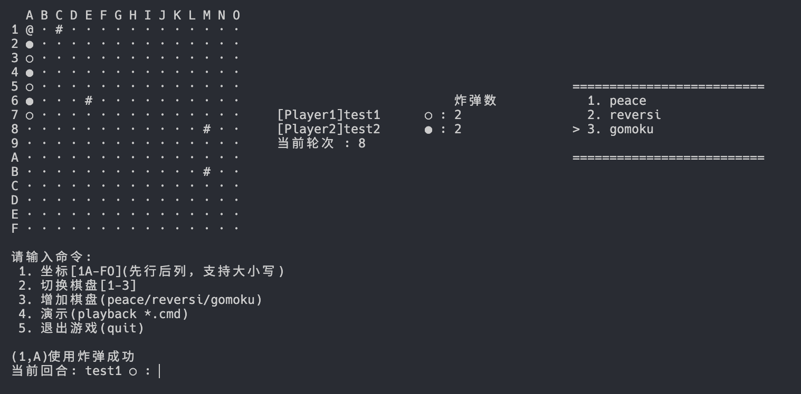

---
puppeteer:
    scale: 1.0
    margin:
        top: 2cm
        right: 3cm
        bottom: 2cm
        left: 3cm
    timeout: 3000
    displayHeaderFooter: true
    headerTemplate: '<span class="pageNumber"></span>'
    footerTemplate: '
        <div style="font-size: 10px; width: 100%; display: flex; justify-content: space-between; padding: 0 20px;">
            <div>
                <span class="pageNumber"></span> / 
                <span class="totalPages"></span>
            </div>
            <div>
                TheSumSt Presents
            </div>
        </div>
        '
---
# Reversi Game Ver5.0 : 翻转棋游戏v5.0

## 1. Manual : 游戏说明

### 1.1. Start : 开始游戏

```bash
java -jar ./target/lab6-5.0.jar cli
```

### 1.2. Play and Rule : 游戏流程与规则

1. 进入游戏
2. 输入玩家1与玩家2名称，并选择棋子颜色
3. 游戏开始，黑棋先行
4. 游戏模式：  
    1. `peace` ：和平模式  
        无规则，不可重复，下满结束
    2. `reversi` : 翻转棋模式  
        标准翻转棋规则  
    3. `gomoku` : 五子棋模式  
        带炸弹和阻碍物的五子棋模式  
5. 规则说明：  
    1. `reversi`规则说明：  
        1. 棋子放置在空格上
        2. 棋子放置后，对方棋子被夹在两个己方棋子之间
        3. 对方被夹住的棋子全部翻转为己方棋子
        4. 轮替：如有合法棋步，必须执行；无合法棋步，输入`pass`跳过
        5. 当前棋盘棋局结束：两方都无合法棋步
        6. 游戏结束：当所有棋盘游戏结束后，可以选择退出
    2. `gomoku`规则说明：  
        1. 棋子放置在空格上
        2. 当某一方的棋子在横向、纵向、左斜、右斜方向上有5个棋子连成一线时，判定为胜利  
        3. 棋盘下满，未有人胜利，判平局  
        4. 障碍物`#`上不可以下棋  
        5. 炸弹只能用来炸对方棋子，炸完后会留下弹坑`@`，其上不能下棋  
            初始白方有3个炸弹，黑方有2个炸弹  
6. 输入说明：  
    1. 棋子位置：`1A`表示第一行第一列
    2. 输入格式：`{行序号}{列序号}`，如`1A`
        *注：现在支持大小写兼容*  
    3. 新建棋盘: `peace`/`reversi`/`gomoku`创建对应模式的新棋盘  
        目前限制最大同时与运行棋盘数为8  
    4. 切换棋盘: 输入对应棋盘序号，切换到对应棋盘
    5. 退出游戏: 可以选择输入`quit`退出游戏  
    6. 专属输入：  
        1. `pass`：跳过操作，`reversi`模式专属  
        2. `@{行序号}{列序号}`：炸弹操作，`gomoku`模式专属  
    7. 演示Demo：`playback {GameMode}.cmd`  
        输入对应的游戏的名称可以进行演示  

## 2. Changelog of Ver5.0 : v5.0更新内容

### 2.1. New Features : 新增特性

1. `gomoku`模式新特性  
    1. 炸弹操作
    2. 初始障碍物  
2. `playback`演示Demo功能  

### 2.2. Optimization : 优化

1. 调整了CLI模式下输入panel的布局  
2. 进一步优化了任务回显的区分度  

## 3. Project Structure : 项目结构

lab6的项目架构经过了新的一轮的大型重构  

总结：  

1. 进一步采用MVC架构  
2. 引入了Observer Pattern模式  

在为GUI模式的设计做准备的同时  
向后兼容了CLI模式的设计  

### 3.1. Specific Structure : 具体结构

```txt
main
├── java
│   └── top
│       └── thesumst
│           ├── Main.java
│           ├── core
│           │   ├── command
│           │   │   ├── BombCommand.java
│           │   │   ├── CommandFactory.java
│           │   │   ├── CommandResult.java
│           │   │   ├── GameCommand.java
│           │   │   ├── GoCommand.java
│           │   │   ├── NewGameCommand.java
│           │   │   ├── PassCommand.java
│           │   │   ├── PlaybackCommand.java
│           │   │   ├── QuitCommand.java
│           │   │   └── SwitchBoardCommand.java
│           │   ├── container
│           │   │   ├── GameContainer.java
│           │   │   └── GameList.java
│           │   ├── loop
│           │   │   ├── CLIGameLoop.java
│           │   │   ├── GUIGameLoop.java
│           │   │   ├── GameLoop.java
│           │   │   └── GameLoopFactory.java
│           │   └── mode
│           │       ├── GameMode.java
│           │       ├── GomokuMode.java
│           │       ├── PeaceMode.java
│           │       └── ReversiMode.java
│           ├── io
│           │   ├── input
│           │   │   ├── InputParser.java
│           │   │   ├── InputResult.java
│           │   │   └── InputType.java
│           │   └── provider
│           │       ├── BaseCommandProvider.java
│           │       ├── CLICommandProvider.java
│           │       ├── CommandProviderFactory.java
│           │       ├── GUICommandProvider.java
│           │       └── PlaybackCommandProvider.java
│           ├── observer
│           │   ├── BaseSubject.java
│           │   ├── Observer.java
│           │   └── Subject.java
│           ├── tools
│           │   ├── PauseTools.java
│           │   └── ScannerTools.java
│           ├── type
│           │   ├── ChessStatement.java
│           │   ├── Direction.java
│           │   ├── Event.java
│           │   ├── EventState.java
│           │   ├── EventType.java
│           │   ├── Operation.java
│           │   ├── OperationType.java
│           │   ├── component
│           │   │   ├── ChessBoard.java
│           │   │   ├── Player.java
│           │   │   └── Step.java
│           │   └── exception
│           │       ├── IllegalCommandException.java
│           │       └── IllegalMoveException.java
│           └── view
│               ├── ViewFactory.java
│               ├── console
│               │   ├── CLIPrintTools.java
│               │   └── CLIView.java
│               └── gui
│                   └── GUIView.java
└── resources
    └── top
        └── thesumst
            └── scripts
                ├── gomoku.cmd
                ├── peace.cmd
                └── reversi.cmd
```

总的来说分为几个具体模块：  

1. model  
    type包中主要是数据模型，包含了棋盘、玩家、步数等基本数据模型  
    core包中是主要游戏逻辑的实现，包含了游戏模式、游戏循环等  
    最直接的与数据模型交互的部分为mode包中的游戏模式  
    container中是游戏运行的容器，游戏模式实例被装在GameList之中，通过GameContainer进行管理  
    container借助loop包中工具进行更具体的游戏循环管理  
2. controller  
    provider包获取来自用户的命令  
    type中的Event作为游戏中主要的信息传递载体  
    command作为重要的控制器，将命令具体化分为一个一个类  
    io负责获取玩家操作并进行解析和处理  
3. view  
    源于observer包中的Observer接口  
    显示的通知来自于Subject的通知  

## 4. Ver5.0 Detail Design : V5.0细节设计

运行流程：  


### 4.1. Bomb Command : 炸弹命令

首先在`GomokuMode`中添加了炸弹命令的相关逻辑  
之后直接添加了一个炸弹命令类`BombCommand`  
然后在`InputParser`中添加了对炸弹命令的解析  
并在`CommandFactory`中注册了该命令  

#### 4.1.1. Parse ： 解析

```java
private static final Pattern BOMB_POSITION = Pattern.compile(
    "^(@)([1-9a-f][a-o])$" ,
    Pattern.CASE_INSENSITIVE
);

Matcher bombMatcher = BOMB_POSITION.matcher(input);
if(bombMatcher.matches()) 
{
    Point position = parsePosition(bombMatcher.group(2));
    // 验证位置是否在棋盘范围内
    if (isValidPosition(position)) {
        return InputResult.useBomb(position);
    }
}
```

#### 4.1.2. Command Logic : 命令逻辑

```java
@Override
public CommandResult execute(GameMode game, GameList gameList) {
    // 执行炸弹操作
    try {
        if (!game.receiveOperation(new Operation<Point>(OperationType.BOMB, position)))
            throw new IllegalMoveException();
        String result = "(" + (position.x + 1) + "," + (char) ('A' + position.y) + ")" + "使用炸弹成功";
        return CommandResult.success(result);
    } catch (IllegalCommandException e) {
        return CommandResult.failure("炸弹失败: " + e.getMessage());
    }
}
```

### 4.2. Event : 事件

数据结构

```java
private EventType type; // 主要表示应该在哪里执行，没有太细粒度
private String rawCommand;
private GameCommand command; // 用来执行，然后用来获取部分信息，如果为null说明是无效输入
private Object data; // 不一定有用
private EventState state; // 事件状态
private String message;
```

#### 4.2.1. Relative State : 相关状态

```java
public enum EventState
{
    EVENT_GET,
    EVENT_PARSED,
    EVENT_EXECUTED_SUCCESS,
    EVENT_EXECUTED_FAIL
}
```

```java
public enum EventType 
{
    GAME_OPERATION, // Operated In GameMode in GameLoop
    GAME_CONTAINER, // Operated In GameContainer
    GAME_START,
    GAME_END;
}
```

#### 4.2.2. Relative Operation : 相关操作

除去普通的setter和getter外，还有eventExecute操作  

```java
public void executeEvent(GameList gameList, int currentGameOrder)
{
    if(command == null)
    {
        setState(EventState.EVENT_EXECUTED_FAIL);
        setMessage("无效命令: " + rawCommand);
        return;
    }

    CommandResult result = getCommand().execute(GameList.getGame(currentGameOrder), gameList);
    if(result.isSuccess()) setState(EventState.EVENT_EXECUTED_SUCCESS);
    else setState(EventState.EVENT_EXECUTED_FAIL);
    setMessage(result.getMessage());
}
```

由于需要具体的游戏信息，因此这一步会在被传递到model层中执行  

### 4.3. Command Provider : 命令提供器


#### 4.3.1. Factory Pattern : 工厂模式

通过`CommandProviderFactory`来创建不同的命令提供器  
用于后续实现GUI基础时能够向后兼容CLI模式的设计  

#### 4.3.2. Event Generation : 事件生成

`BaseCommandProvider`类中有一个`getEvent()`方法  
用作获取事件的统一接口  

逻辑为借助`Event`作为统一模型进行封装  
然后将其中的原始命令字符串经过`InputParser`进行解析  
如果匹配成功则获得对应`GameCommand`，同样封装到`Event`中  

### 4.4. GameLoop : 游戏循环

GameLoop包实现了游戏主循环的管理，采用模板方法模式和工厂方法模式。


#### 4.4.1. Factory Pattern : 工厂模式

`GameLoopFactory`提供统一的GameLoop创建接口：
同样是为了后续实现GUI基础时能够向后兼容CLI模式的设计  

#### 4.4.2. Multilevel Event Handle : 多级事件处理

对于应该是在不同游戏中进行的操作，或者非游戏内部逻辑的操作  
将`Event`上交到上级`GameContainer`进行处理  

### 4.5. Demo Playback : Demo回放

#### 4.5.1. Parse and Register : 解析与注册

同样在`InputParser`以及`CommandFactory`中添加了对演示命令的解析与注册  

#### 4.5.2. Playback Command : 演示命令

实际上该命令只是用来具体测试能否打开该演示脚本  

```java
public class PlaybackCommand implements GameCommand
{
    String filename;

    public PlaybackCommand(String filename)
    {
        this.filename = filename;
    }

    @Override
    public CommandResult execute(GameMode gameMode, GameList gameList) 
    {
        try {
            // 检测文件是否存在
            if (filename == null || filename.isEmpty())
                throw new IllegalCommandException("回放文件名不能为空");

            String resourcePath = "/top/thesumst/scripts/" + filename;
            InputStream inputStream = PlaybackCommandProvider.class.getResourceAsStream(resourcePath);
            if (inputStream == null)
                throw new IllegalCommandException("无法在类路径中找到资源: " + resourcePath);
            return CommandResult.success("Demo模式开始使用: " + filename);
        } catch (IllegalCommandException e) {
            return CommandResult.failure("回放失败: " + e.getMessage());
        }
    }
}
```

#### 4.5.3. Playback Command Provider : 演示命令提供器

`PlaybackCommandProvider`直接继承自`CLICommandProvider`  
通过传入脚本filename
在`/top/thesumst/scripts`目录下进行搜索  
编写时是`/src/main/resources/top/thesumst/scripts/`  
直接将脚本封装到了游戏包中  
通过`PlaybackCommandFactory`使用`InputStream`进行统一逐行转译为事件之后  
在`GameLoop`中进行统一回放  

```java
public class PlaybackCommandProvider extends CLICommandProvider 
{
    private final List<String> rawCommands;

    // 构造函数现在接收文件名，而不是完整的文件系统路径
    public PlaybackCommandProvider(String scriptFileName) throws IOException 
    {
        super(CommandProviderMode.PLAYBACK);

        // 构建相对于类路径根的资源路径
        // 假设你的脚本在 resources/top/thesumst/scripts/ 目录下
        String resourcePath = "/top/thesumst/scripts/" + scriptFileName;

        // 使用 PlaybackCommandProvider 类的类加载器获取资源
        InputStream inputStream = PlaybackCommandProvider.class.getResourceAsStream(resourcePath);

        if (inputStream == null)
            throw new IOException("无法在类路径中找到资源: " + resourcePath);

        // 从 InputStream 读取所有行
        try (BufferedReader reader = new BufferedReader(new InputStreamReader(inputStream, StandardCharsets.UTF_8))) {
            this.rawCommands = reader.lines().collect(Collectors.toList());
        }
    }

    public List<Event> getEvents() {
        List<Event> events = new ArrayList<>();
        for (String rawCommand : rawCommands) {
            // 确保 CLICommandProvider 中的 inputBuffer 是可以被子类访问和设置的
            // 如果 inputBuffer 是 private 的，你可能需要一个 protected 的 setter 方法
            // 或者修改 CLICommandProvider.getEvent() 的行为以接受参数
            inputBuffer = rawCommand; // 假设有这样一个方法，或者 inputBuffer 是 protected
            events.add(super.getEvent());
        }
        return events;
    }
}
```

#### 4.5.4. Event Playback : 事件回放

```java
public void playback(List<Event> events)
{
    for(Event event : events)
    {
        event.executeEvent(gameList, currentGameOrder);
        notifyObservers(event, gameList, currentGameOrder);
        try {
            Thread.sleep(500);
        } catch (InterruptedException e) {
            e.printStackTrace();
        }
    }
}
```

### 4.6. Startup Arg in Main : 启动参数

在`Main`类中添加了对启动参数的解析

```java
public static void main(String[] args) 
{
    gameMotd();
    try{
        observer = ViewFactory.getView(args[0]);
        cmdProvider = CommandProviderFactory.getCommandProvider(args[0]);
        gameList = new GameList();
        gameLoop = GameLoopFactory.getGameLoop(args[0], gameList, cmdProvider, observer);
        gameContainer = new GameContainer(gameList, gameLoop, cmdProvider, observer);
        gameContainer.runGame();
    } catch (ArrayIndexOutOfBoundsException e) {
        System.out.println("启动模式参数错误: " + e.getMessage());
        System.out.println("请使用 'cli' 或 'gui' 启动游戏");
    } catch (IllegalArgumentException e) {
        System.out.println(e.getMessage());
    } catch (Exception e) {
        System.out.println("发生了未知错误: " + e.getMessage());
    }
}
```

## 5. Presentation of Test Running : 运行测试

### Bomb : 炸弹

  



### Playback : 回放


  

  

  
