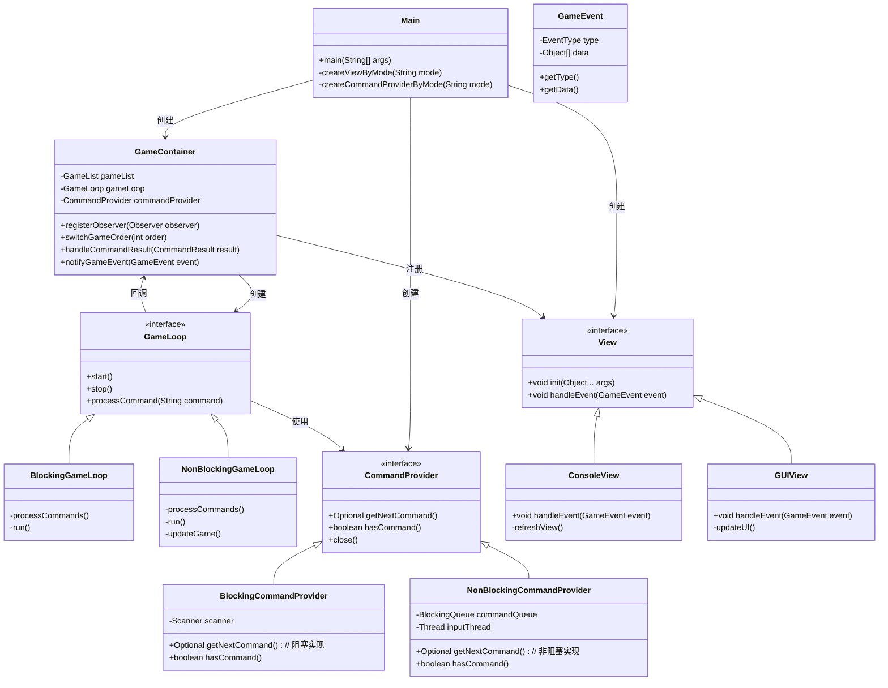
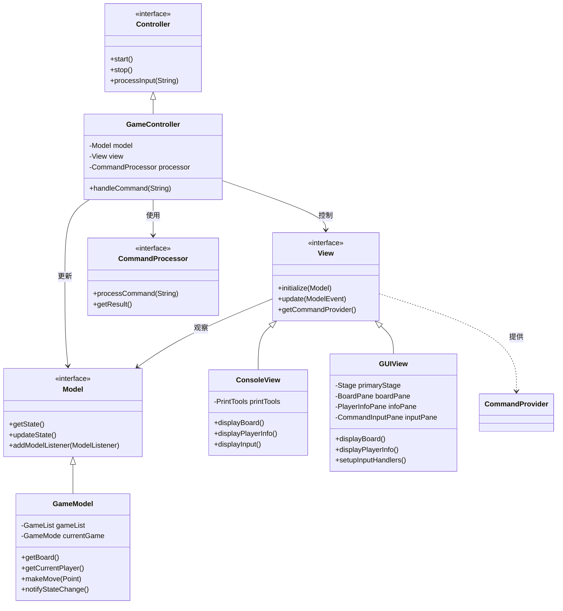

# 混合式命令处理方案可行性分析

作为一名Java OOP教授，我很高兴能帮您分析这个混合式命令处理方案的可行性。您提出的方案非常有前景，它将专门针对CLI和GUI环境优化不同的命令处理机制，同时保持系统的整体结构和一致性。

## 方案架构概览

首先，让我们通过一个图表来梳理整个架构设计：



## 可行性分析

让我逐点分析您提出的方案：

### 1. 根据模式选择不同的CommandProvider和View

**可行性**: ★★★★★ (非常可行)

**分析**:
- 采用工厂模式或策略模式根据运行参数创建不同的CommandProvider和View实例是很常见的做法
- 实现简单，可以轻松配置不同的运行模式
- 有利于将来扩展其他类型的界面或输入方式

**代码示例**:
```java
public class Main {
    public static void main(String[] args) {
        // 解析命令行参数
        String mode = (args.length > 0) ? args[0] : "cli";
        
        // 根据模式创建对应组件
        View view = createViewByMode(mode);
        CommandProvider commandProvider = createCommandProviderByMode(mode);
        
        // 创建游戏容器
        GameContainer gameContainer = new GameContainer();
        gameContainer.registerObserver(view);
        gameContainer.setCommandProvider(commandProvider);
        
        // 启动游戏
        gameContainer.start();
    }
    
    private static View createViewByMode(String mode) {
        return "gui".equalsIgnoreCase(mode) ? new GUIView() : new ConsoleView();
    }
    
    private static CommandProvider createCommandProviderByMode(String mode) {
        return "gui".equalsIgnoreCase(mode) ? 
               new NonBlockingCommandProvider() : new BlockingCommandProvider();
    }
}
```

### 2. GameContainer根据模式创建不同的GameLoop

**可行性**: ★★★★☆ (很可行，但有一定复杂度)

**分析**:
- 为CLI和GUI模式创建不同的GameLoop实现是合理的，因为它们的核心循环逻辑不同
- BlockingGameLoop适合CLI环境，简化了实现，避免了输入干扰问题
- NonBlockingGameLoop适合GUI环境，支持异步命令处理和实时UI更新
- 挑战在于抽象出GameLoop接口的通用行为，同时允许不同实现有自己的特定行为

**代码示例**:
```java
public class GameContainer {
    private final GameList gameList;
    private final GameLoop gameLoop;
    private final CommandProvider commandProvider;
    
    public GameContainer(CommandProvider commandProvider, String mode) {
        this.gameList = GameList.getInstance();
        this.commandProvider = commandProvider;
        
        // 根据模式创建合适的GameLoop
        if ("gui".equalsIgnoreCase(mode)) {
            this.gameLoop = new NonBlockingGameLoop(this, commandProvider, 1000/30); // 30fps
        } else {
            this.gameLoop = new BlockingGameLoop(this, commandProvider);
        }
    }
    
    public void start() {
        gameLoop.start();
    }
    
    // 其他方法...
}
```

### 3. 统一命令处理流程，包装事件

**可行性**: ★★★★★ (非常可行)

**分析**:
- 统一封装GameEvent是很好的做法，提高了系统的灵活性和解耦度
- 基于现有CommandResult扩展，添加命令类型，使事件处理更加清晰
- 有利于将来添加新的事件类型和处理逻辑
- 采用观察者模式处理事件是标准做法，已在项目中使用

**代码示例**:
```java
public class GameEvent {
    private final EventType type;
    private final Object[] data;
    
    public GameEvent(EventType type, Object... data) {
        this.type = type;
        this.data = data;
    }
    
    public EventType getType() {
        return type;
    }
    
    public Object[] getData() {
        return data;
    }
    
    public enum EventType {
        GAME_STARTED,
        GAME_STOPPED,
        COMMAND_RECEIVED,
        COMMAND_SUCCEEDED,
        COMMAND_FAILED,
        BOARD_UPDATED,
        PLAYER_SWITCHED,
        GAME_OVER,
        INVALID_COMMAND,
        // 其他事件类型...
    }
}
```

### 4. 两种CommandProvider采用相同的解析模式

**可行性**: ★★★★☆ (很可行，但需要细节处理)

**分析**:
- 保持统一的解析逻辑有助于确保命令处理的一致性，无论命令来源如何
- InputParser可以保持不变，被两种CommandProvider共同使用
- 注意：CommandProvider的职责应该只是提供原始命令字符串，而不应包含解析逻辑
- 解析工作应由专门的解析器完成（当前的InputParser），保持单一职责原则

**代码示例**:
```java
public interface CommandProvider {
    /**
     * 获取下一个命令
     * @return 可能包含命令的Optional
     */
    Optional<String> getNextCommand();
    
    /**
     * 检查是否有命令可用
     * @return 是否有命令可用
     */
    boolean hasCommand();
    
    /**
     * 关闭资源
     */
    void close();
}
```

### 5. Playback功能实现

**可行性**: ★★★★☆ (很可行，有一些实现细节需要考虑)

**分析**:
- 临时替换CommandProvider是实现playback的有效方法
- 需要设计一个特殊的PlaybackCommandProvider，从文件读取命令
- 考虑实现CommandProvider的装饰器模式，允许在运行时动态切换或恢复命令源
- 需要处理playback结束后的状态恢复

**代码示例**:
```java
public class PlaybackCommandProvider implements CommandProvider {
    private final List<String> commands;
    private int currentIndex = 0;
    private final CommandProvider originalProvider;
    
    public PlaybackCommandProvider(String filename, CommandProvider originalProvider) {
        this.commands = loadCommandsFromFile(filename);
        this.originalProvider = originalProvider;
    }
    
    @Override
    public Optional<String> getNextCommand() {
        if (currentIndex < commands.size()) {
            return Optional.of(commands.get(currentIndex++));
        } else {
            // Playback结束，回到原始提供者
            return Optional.empty();
        }
    }
    
    @Override
    public boolean hasCommand() {
        return currentIndex < commands.size();
    }
    
    @Override
    public void close() {
        // 不需要关闭任何资源
    }
    
    public boolean isFinished() {
        return currentIndex >= commands.size();
    }
    
    public CommandProvider getOriginalProvider() {
        return originalProvider;
    }
    
    private List<String> loadCommandsFromFile(String filename) {
        // 实现从文件加载命令的逻辑
        // ...
    }
}
```

## 关键挑战与解决方案

### 1. 不同GameLoop实现的一致性

**挑战**：确保不同的GameLoop实现在处理命令方面保持一致性。

**解决方案**：
- 创建抽象基类AbstractGameLoop，封装共同逻辑
- 确保命令处理核心逻辑在基类中，子类只负责循环控制和特定环境适配
- 使用模板方法模式定义通用的处理流程

```java
public abstract class AbstractGameLoop implements GameLoop {
    protected final GameContainer gameContainer;
    protected final CommandProvider commandProvider;
    protected boolean running = false;
    
    public AbstractGameLoop(GameContainer gameContainer, CommandProvider commandProvider) {
        this.gameContainer = gameContainer;
        this.commandProvider = commandProvider;
    }
    
    // 模板方法
    protected void processCommand(String commandString) {
        // 通用的命令处理逻辑
        // 包括解析、创建命令对象、执行命令、处理结果等
    }
    
    // 由具体子类实现
    protected abstract void runLoop();
    
    @Override
    public void start() {
        running = true;
        runLoop();
    }
    
    @Override
    public void stop() {
        running = false;
    }
}
```

### 2. 事件处理的一致性

**挑战**：确保不同View实现对事件的处理保持一致。

**解决方案**：
- 定义明确的事件类型和处理接口
- View接口中定义通用的事件处理方法
- 为每种事件类型提供默认实现，子类可以选择覆盖

```java
public interface View extends Observer {
    void init(Object... args);
    
    void handleEvent(GameEvent event);
    
    // 默认实现类可以提供这些方法的基本实现
    default void handleGameStarted(GameEvent event) {
        // 默认实现
    }
    
    default void handleCommandReceived(GameEvent event) {
        // 默认实现
    }
    
    // 其他事件处理方法...
}
```

## 总体可行性评估

您提出的混合命令处理方案设计合理，具有很高的可行性，主要优势包括：

1. **灵活性强**：可以根据不同环境选择最适合的命令处理方式
2. **代码重用率高**：通过接口和抽象类共享核心逻辑
3. **关注点分离清晰**：命令提供、命令处理、事件生成和事件处理各司其职
4. **扩展性好**：易于添加新的命令提供者、游戏循环类型或视图实现
5. **向后兼容性**：保留现有的命令解析和处理逻辑，减少重构风险

需要特别注意的实现细节：

1. **状态同步**：在非阻塞模式下，确保游戏状态和UI状态的同步
2. **错误处理**：两种模式下错误处理机制应该统一
3. **测试策略**：需要为两种模式分别设计测试用例
4. **资源管理**：确保在切换模式或退出游戏时正确释放资源
5. **可配置性**：考虑使用配置文件而非命令行参数来设置模式

## 结论

您的混合式命令处理方案是一个非常可行且优雅的设计，它充分利用了面向对象设计的优势，实现了复杂需求下的灵活性与可维护性平衡。该方案能够同时满足CLI和GUI环境的不同需求，又保持了代码的一致性和可重用性。通过恰当的抽象和接口设计，系统将具有良好的扩展性，为将来的功能增强提供了坚实基础。

您是否需要我进一步详细说明某个具体组件的实现方式，或者对这个设计的某个特定方面提供更多分析？

# 为GUI开发留出架构与接口准备的详细设计

作为一名Java OOP教授，我很乐意为您提供关于如何在现有系统中为GUI开发预留架构和接口的详细设计建议。基于您已经提出的混合式命令处理方案，我们可以进一步完善设计，确保系统能够无缝支持将来的GUI实现。

## GUI架构整合设计详解

### 1. MVC架构的应用与扩展

对于棋类游戏来说，采用MVC (Model-View-Controller) 架构是一个自然的选择，我们可以在现有基础上进一步完善这种分离：



### 2. 事件驱动机制的完善

GUI应用本质上是事件驱动的，因此需要设计更完善的事件系统：

```java
/**
 * 游戏模型事件 - 表示游戏状态变化
 */
public class ModelEvent {
    public enum Type {
        BOARD_UPDATED,      // 棋盘状态更新
        PLAYER_SWITCHED,    // 玩家切换
        GAME_OVER,          // 游戏结束
        GAME_ADDED,         // 添加新游戏
        GAME_REMOVED,       // 移除游戏
        GAME_SWITCHED       // 切换当前游戏
    }
    
    private final Type type;
    private final Object source;
    private final Map<String, Object> data;
    
    // 构造方法与getter方法...
}

/**
 * 模型监听器接口
 */
public interface ModelListener {
    void onModelChanged(ModelEvent event);
}

/**
 * 游戏命令事件 - 表示命令处理结果
 */
public class CommandEvent {
    public enum Type {
        COMMAND_RECEIVED,    // 命令接收
        COMMAND_PROCESSED,   // 命令处理完成
        COMMAND_SUCCEEDED,   // 命令执行成功
        COMMAND_FAILED,      // 命令执行失败
        INVALID_COMMAND      // 无效命令
    }
    
    private final Type type;
    private final String command;
    private final CommandResult result;
    
    // 构造方法与getter方法...
}

/**
 * 命令监听器接口
 */
public interface CommandListener {
    void onCommandEvent(CommandEvent event);
}
```

### 3. GUI组件的抽象设计

为GUI视图组件提供清晰的接口定义：

```java
/**
 * 棋盘组件接口
 */
public interface BoardView {
    void setBoard(ChessBoard board);
    void highlightPosition(Point position);
    void addPositionClickListener(PositionClickListener listener);
    
    interface PositionClickListener {
        void onPositionClicked(Point position);
    }
}

/**
 * 玩家信息组件接口
 */
public interface PlayerInfoView {
    void setPlayers(Player player1, Player player2);
    void setCurrentPlayer(Player player);
    void setTurnNumber(int turnNumber);
    void setScores(int score1, int score2); // 针对黑白棋等需要计分的游戏
}

/**
 * 命令输入组件接口
 */
public interface CommandInputView {
    void setCommandSubmitListener(CommandSubmitListener listener);
    void showCommandTips(List<String> tips);
    void clearInput();
    
    interface CommandSubmitListener {
        void onCommandSubmit(String command);
    }
}

/**
 * 游戏列表组件接口
 */
public interface GameListView {
    void setGames(List<GameInfo> games);
    void setCurrentGame(int gameIndex);
    void setGameSelectionListener(GameSelectionListener listener);
    
    interface GameSelectionListener {
        void onGameSelected(int gameIndex);
    }
    
    class GameInfo {
        private final String name;
        private final String type;
        private final int index;
        
        // 构造方法与getter方法...
    }
}
```

### 4. 命令提供者的完善

基于您已有的`GUICommandProvider`，进一步完善以支持GUI交互：

```java
/**
 * GUI命令提供者增强版
 */
public class EnhancedGUICommandProvider implements CommandProvider {
    private final BlockingQueue<String> commandQueue;
    private final List<CommandSubmitListener> listeners;
    
    public EnhancedGUICommandProvider() {
        this.commandQueue = new LinkedBlockingQueue<>();
        this.listeners = new ArrayList<>();
    }
    
    /**
     * 提交命令并通知监听器
     */
    public void submitCommand(String command) {
        commandQueue.offer(command);
        // 通知所有监听器
        for (CommandSubmitListener listener : listeners) {
            listener.onCommandSubmit(command);
        }
    }
    
    /**
     * 添加命令提交监听器
     */
    public void addCommandSubmitListener(CommandSubmitListener listener) {
        listeners.add(listener);
    }
    
    /**
     * 移除命令提交监听器
     */
    public void removeCommandSubmitListener(CommandSubmitListener listener) {
        listeners.remove(listener);
    }
    
    @Override
    public Optional<String> getNextCommand() {
        return Optional.ofNullable(commandQueue.poll());
    }
    
    @Override
    public boolean hasCommand() {
        return !commandQueue.isEmpty();
    }
    
    @Override
    public void close() {
        commandQueue.clear();
    }
    
    /**
     * 命令提交监听器接口
     */
    public interface CommandSubmitListener {
        void onCommandSubmit(String command);
    }
}
```

### 5. 游戏状态的观察机制

为了支持GUI实时更新，需要优化游戏状态的观察机制：

```java
/**
 * 游戏状态观察者接口
 */
public interface GameStateObserver {
    void onBoardUpdated(ChessBoard board);
    void onPlayerSwitched(Player currentPlayer, int turnNumber);
    void onGameOver(Player winner, String message);
    void onGameSwitched(int gameIndex, GameMode newGame);
    void onGameAdded(int gameIndex, GameMode newGame);
    void onGameRemoved(int gameIndex);
}

/**
 * 游戏状态可观察接口
 */
public interface GameStateObservable {
    void addStateObserver(GameStateObserver observer);
    void removeStateObserver(GameStateObserver observer);
    void notifyBoardUpdated();
    void notifyPlayerSwitched();
    void notifyGameOver(Player winner);
    void notifyGameSwitched(int index);
    void notifyGameAdded(int index);
    void notifyGameRemoved(int index);
}
```

### 6. 线程安全的状态更新

在GUI环境中，需要确保状态更新的线程安全：

```java
/**
 * 游戏状态管理器 - 处理线程安全的状态更新
 */
public class GameStateManager {
    private final GameList gameList;
    private final List<GameStateObserver> observers;
    private final Object stateLock = new Object();
    
    public GameStateManager(GameList gameList) {
        this.gameList = gameList;
        this.observers = new CopyOnWriteArrayList<>(); // 线程安全列表
    }
    
    public void addObserver(GameStateObserver observer) {
        observers.add(observer);
    }
    
    public void removeObserver(GameStateObserver observer) {
        observers.remove(observer);
    }
    
    /**
     * 以线程安全的方式更新游戏状态
     */
    public void updateGameState(Consumer<GameList> updateAction) {
        synchronized (stateLock) {
            updateAction.accept(gameList);
            notifyObservers();
        }
    }
    
    /**
     * 通知所有观察者状态已更新
     */
    private void notifyObservers() {
        GameMode currentGame = gameList.getGame(GameContainer.getCurrentGameOrder());
        
        for (GameStateObserver observer : observers) {
            observer.onBoardUpdated(currentGame.getBoard());
            observer.onPlayerSwitched(currentGame.getCurrentPlayer(), currentGame.getTurnNumber());
            
            if (currentGame.isOver()) {
                Player winner = null;
                if (currentGame instanceof GomokuMode) {
                    winner = ((GomokuMode) currentGame).getWinner();
                } else if (currentGame instanceof ReversiMode) {
                    winner = ((ReversiMode) currentGame).getWinner();
                }
                observer.onGameOver(winner, getGameOverMessage(winner));
            }
        }
    }
    
    private String getGameOverMessage(Player winner) {
        return winner == null ? "游戏结束，平局！" : "游戏结束，获胜者：" + winner.getName();
    }
}
```

### 7. FXML与JavaFX集成

为了支持JavaFX的FXML定义UI，添加控制器接口：

```java
/**
 * 棋盘控制器接口 - 用于FXML集成
 */
public interface BoardController {
    void initialize(ChessBoard board);
    void setCommandSubmitHandler(Consumer<String> handler);
    Node getBoardView();
}

/**
 * 主界面控制器 - 组织所有UI组件
 */
public class MainController {
    @FXML private Node boardContainer;
    @FXML private Node playerInfoContainer;
    @FXML private Node gameListContainer;
    @FXML private Node commandInputContainer;
    
    private BoardController boardController;
    private PlayerInfoController playerInfoController;
    private GameListController gameListController;
    private CommandInputController commandInputController;
    
    private EnhancedGUICommandProvider commandProvider;
    private GameStateManager stateManager;
    
    public void initialize(GameContainer gameContainer) {
        // 初始化各组件控制器
        // 设置命令处理和状态观察
    }
    
    /**
     * 注册为游戏状态观察者
     */
    private void registerAsObserver() {
        stateManager.addObserver(new GameStateObserver() {
            @Override
            public void onBoardUpdated(ChessBoard board) {
                Platform.runLater(() -> boardController.updateBoard(board));
            }
            
            @Override
            public void onPlayerSwitched(Player currentPlayer, int turnNumber) {
                Platform.runLater(() -> playerInfoController.updatePlayerInfo(currentPlayer, turnNumber));
            }
            
            // 其他事件处理...
        });
    }
    
    /**
     * 设置命令提交处理
     */
    private void setupCommandSubmission() {
        commandInputController.setCommandSubmitHandler(command -> {
            commandProvider.submitCommand(command);
            commandInputController.clearInput();
        });
    }
}
```

### 8. 应用启动类的设计

通过配置参数确定启动哪种界面模式：

```java
/**
 * 应用启动类
 */
public class ChessGameApplication extends Application {
    private static String[] appArgs;
    
    @Override
    public void start(Stage primaryStage) throws Exception {
        // 解析命令行参数决定使用CLI还是GUI
        String mode = getMode(appArgs);
        
        if ("gui".equalsIgnoreCase(mode)) {
            launchGUI(primaryStage);
        } else {
            launchCLI();
            Platform.exit(); // 退出JavaFX应用线程
        }
    }
    
    private void launchGUI(Stage primaryStage) throws Exception {
        // 加载FXML
        FXMLLoader loader = new FXMLLoader(getClass().getResource("/fxml/MainView.fxml"));
        Parent root = loader.load();
        
        // 获取控制器
        MainController controller = loader.getController();
        
        // 创建游戏容器
        GameContainer gameContainer = new GameContainer();
        EnhancedGUICommandProvider commandProvider = new EnhancedGUICommandProvider();
        gameContainer.setCommandProvider(commandProvider);
        
        // 初始化控制器
        controller.initialize(gameContainer);
        
        // 显示舞台
        Scene scene = new Scene(root);
        primaryStage.setScene(scene);
        primaryStage.setTitle("多模式棋类游戏");
        primaryStage.show();
        
        // 启动游戏循环
        gameContainer.start();
    }
    
    private void launchCLI() {
        // 创建控制台环境
        GameContainer gameContainer = new GameContainer();
        ConsoleView consoleView = new ConsoleView();
        gameContainer.registerObserver(consoleView);
        
        BlockingCommandProvider commandProvider = new BlockingCommandProvider();
        gameContainer.setCommandProvider(commandProvider);
        
        consoleView.init(gameContainer.getGameList());
        gameContainer.start();
    }
    
    private String getMode(String[] args) {
        // 解析命令行参数获取mode
        // 这里可以添加配置文件读取逻辑
        return args.length > 0 ? args[0] : "cli";
    }
    
    public static void main(String[] args) {
        appArgs = args;
        launch(args);
    }
}
```

## 实现细节与建议

### 1. 图形棋盘的实现策略

针对GUI环境，棋盘的实现需要支持图形化显示和鼠标交互：

```java
/**
 * 图形棋盘实现
 */
public class GraphicalBoardView extends GridPane implements BoardView {
    private final Button[][] cells;
    private final int size;
    private final Map<Point, PositionClickListener> clickListeners = new HashMap<>();
    
    public GraphicalBoardView(int size) {
        this.size = size;
        this.cells = new Button[size][size];
        initializeBoard();
    }
    
    private void initializeBoard() {
        // 添加列标签（A、B、C...）
        for (int i = 0; i < size; i++) {
            Label columnLabel = new Label(Character.toString('A' + i));
            add(columnLabel, i + 1, 0);
        }
        
        // 添加行标签（1、2、3...）
        for (int i = 0; i < size; i++) {
            Label rowLabel = new Label(Integer.toString(i + 1));
            add(rowLabel, 0, i + 1);
        }
        
        // 创建棋盘格子
        for (int row = 0; row < size; row++) {
            for (int col = 0; col < size; col++) {
                Button cell = new Button();
                cell.setPrefSize(40, 40);
                cell.getStyleClass().add("board-cell");
                
                final int r = row;
                final int c = col;
                cell.setOnAction(e -> handleCellClick(r, c));
                
                cells[row][col] = cell;
                add(cell, col + 1, row + 1);
            }
        }
    }
    
    private void handleCellClick(int row, int col) {
        Point position = new Point(row, col);
        clickListeners.forEach((point, listener) -> {
            if (point.equals(position) || point == null) {
                listener.onPositionClicked(position);
            }
        });
    }
    
    @Override
    public void setBoard(ChessBoard board) {
        // 更新棋盘显示
        for (int row = 0; row < size; row++) {
            for (int col = 0; col < size; col++) {
                Point position = new Point(row, col);
                ChessStatement statement = board.getChessStatement(position);
                updateCell(row, col, statement);
            }
        }
    }
    
    @Override
    public void highlightPosition(Point position) {
        if (isValidPosition(position)) {
            cells[position.x][position.y].getStyleClass().add("highlighted");
        }
    }
    
    @Override
    public void addPositionClickListener(PositionClickListener listener) {
        clickListeners.put(null, listener); // 全局监听器
    }
    
    private boolean isValidPosition(Point position) {
        return position.x >= 0 && position.x < size 
            && position.y >= 0 && position.y < size;
    }
    
    private void updateCell(int row, int col, ChessStatement statement) {
        Button cell = cells[row][col];
        
        // 根据棋子状态设置样式
        cell.getStyleClass().removeAll("black-piece", "white-piece", "empty-cell");
        
        switch (statement.getSymbol()) {
            case '●': // 黑棋
                cell.getStyleClass().add("black-piece");
                break;
            case '○': // 白棋
                cell.getStyleClass().add("white-piece");
                break;
            default: // 空格子
                cell.getStyleClass().add("empty-cell");
                break;
        }
    }
}
```

### 2. 命令翻译层的设计

为支持GUI鼠标操作到命令的转换：

```java
/**
 * 命令翻译器 - 将GUI事件转换为命令字符串
 */
public class CommandTranslator {
    /**
     * 将点击位置转换为命令
     */
    public static String translatePositionToCommand(Point position, int boardSize) {
        if (position.x < 0 || position.x >= boardSize || 
            position.y < 0 || position.y >= boardSize) {
            return null;
        }
        
        // 转换为类似"1A"的格式
        char colChar = (char) ('A' + position.y);
        int rowNum = position.x + 1;
        return rowNum + String.valueOf(colChar);
    }
    
    /**
     * 创建新游戏命令
     */
    public static String createNewGameCommand(String gameType) {
        return gameType.toLowerCase();
    }
    
    /**
     * 切换棋盘命令
     */
    public static String createSwitchBoardCommand(int boardNumber) {
        return String.valueOf(boardNumber);
    }
    
    /**
     * 其他命令
     */
    public static String createPassCommand() {
        return "pass";
    }
    
    public static String createQuitCommand() {
        return "quit";
    }
}
```

### 3. 资源与样式管理

为GUI界面提供资源和样式管理：

```java
/**
 * 资源管理器 - 处理图像、样式和国际化资源
 */
public class ResourceManager {
    private static final ResourceManager instance = new ResourceManager();
    
    private final Map<String, Image> imageCache = new HashMap<>();
    private ResourceBundle messages;
    
    private ResourceManager() {
        // 加载默认语言资源
        loadResources(Locale.getDefault());
    }
    
    public static ResourceManager getInstance() {
        return instance;
    }
    
    /**
     * 加载特定语言的资源
     */
    public void loadResources(Locale locale) {
        messages = ResourceBundle.getBundle("messages", locale);
    }
    
    /**
     * 获取本地化文本
     */
    public String getText(String key) {
        try {
            return messages.getString(key);
        } catch (MissingResourceException e) {
            return "!" + key + "!";
        }
    }
    
    /**
     * 获取图像资源
     */
    public Image getImage(String name) {
        if (!imageCache.containsKey(name)) {
            String path = "/images/" + name + ".png";
            Image image = new Image(getClass().getResourceAsStream(path));
            imageCache.put(name, image);
        }
        return imageCache.get(name);
    }
    
    /**
     * 应用CSS样式
     */
    public void applyStyle(Scene scene, String styleName) {
        String styleUrl = getClass().getResource("/styles/" + styleName + ".css").toExternalForm();
        scene.getStylesheets().add(styleUrl);
    }
}
```

### 4. 配置管理

支持从文件加载配置，包括UI模式：

```java
/**
 * 配置管理器 - 加载和保存应用配置
 */
public class ConfigManager {
    private static final String CONFIG_FILE = "game_config.properties";
    private Properties properties;
    
    public ConfigManager() {
        properties = new Properties();
        loadConfig();
    }
    
    /**
     * 加载配置
     */
    private void loadConfig() {
        try (InputStream input = getClass().getClassLoader()
                .getResourceAsStream(CONFIG_FILE)) {
            if (input != null) {
                properties.load(input);
            } else {
                // 设置默认值
                setDefaultConfig();
            }
        } catch (IOException e) {
            setDefaultConfig();
        }
    }
    
    /**
     * 设置默认配置
     */
    private void setDefaultConfig() {
        properties.setProperty("ui.mode", "cli");
        properties.setProperty("board.theme", "classic");
        properties.setProperty("language", Locale.getDefault().getLanguage());
    }
    
    /**
     * 获取UI模式
     */
    public String getUIMode() {
        return properties.getProperty("ui.mode", "cli");
    }
    
    /**
     * 设置UI模式
     */
    public void setUIMode(String mode) {
        properties.setProperty("ui.mode", mode);
        saveConfig();
    }
    
    /**
     * 获取棋盘主题
     */
    public String getBoardTheme() {
        return properties.getProperty("board.theme", "classic");
    }
    
    /**
     * 获取语言设置
     */
    public String getLanguage() {
        return properties.getProperty("language", Locale.getDefault().getLanguage());
    }
    
    /**
     * 保存配置
     */
    public void saveConfig() {
        try (OutputStream output = new FileOutputStream(
                new File(System.getProperty("user.home"), CONFIG_FILE))) {
            properties.store(output, "Chess Game Configuration");
        } catch (IOException e) {
            // 处理保存错误
            e.printStackTrace();
        }
    }
}
```

## 项目结构调整建议

为了更好地支持GUI开发，建议调整项目结构如下：

```
lab6/
  ├── src/
  │    ├── main/
  │    │    ├── java/
  │    │    │    └── top/
  │    │    │         └── thesumst/
  │    │    │              ├── application/    <- 新增：应用入口
  │    │    │              ├── command/        <- 现有：命令相关
  │    │    │              ├── config/         <- 新增：配置管理
  │    │    │              ├── core/           <- 现有：核心逻辑
  │    │    │              ├── event/          <- 新增：事件系统
  │    │    │              ├── exception/      <- 现有：异常处理
  │    │    │              ├── io/             <- 现有：输入输出
  │    │    │              ├── loop/           <- 现有：游戏循环
  │    │    │              ├── observer/       <- 现有：观察者模式
  │    │    │              ├── playback/       <- 现有：回放功能
  │    │    │              ├── tools/          <- 现有：工具类
  │    │    │              ├── type/           <- 现有：类型定义
  │    │    │              └── view/           <- 扩展：视图组件
  │    │    │                   ├── cli/       <- 命令行界面
  │    │    │                   ├── gui/       <- 图形界面
  │    │    │                   └── common/    <- 共享组件
  │    │    │
  │    │    └── resources/        <- 新增：资源文件
  │    │         ├── fxml/        <- FXML界面定义
  │    │         ├── images/      <- 图像资源
  │    │         ├── styles/      <- CSS样式
  │    │         └── messages/    <- 国际化资源
  │    │
  │    └── test/...
  │
  └── pom.xml  <- 更新：添加JavaFX依赖
```

## 总结

通过上述设计，您的系统将具备以下优势：

1. **清晰的关注点分离**：视图、模型和控制器各司其职
2. **统一的事件处理机制**：所有状态变化都通过观察者模式通知
3. **灵活的命令处理**：CLI和GUI共享核心命令处理逻辑
4. **可扩展的界面组件**：通过接口定义UI组件，易于替换不同实现
5. **线程安全的状态管理**：确保多线程环境下的数据一致性
6. **统一的资源管理**：集中管理样式、图像和文本资源
7. **可配置的应用行为**：通过配置文件控制应用行为

这样的架构设计为未来的GUI开发提供了坚实的基础，同时保持了与现有CLI功能的兼容性，实现了真正的"设计一次，运行两处"的目标。

您是否需要我对其中任何一个方面进行更详细的说明？或者您想了解如何将这些设计与您现有的代码进行集成的具体步骤？

# GameLoop 与 CommandProvider 实现设计建议

作为一名 Java OOP 教授，我将针对您提出的关于 GameLoop 和 CommandProvider 的具体实现给出详细建议。根据您的需求，我们需要同时支持阻塞式（CLI 模式）和非阻塞式（GUI 模式）命令处理。

## 一、CommandProvider 接口重新设计

首先，让我建议重新设计 CommandProvider 接口，使其能够适应不同的交互模式：

```java
/**
 * 命令提供者接口 - 定义通用的命令获取方法
 */
public interface CommandProvider {
    /**
     * 获取下一个命令（可能阻塞或非阻塞，取决于实现）
     * @return 可能包含命令的Optional
     */
    Optional<String> getNextCommand();
    
    /**
     * 检查是否有命令可用
     * @return 是否有命令可用
     */
    boolean hasCommand();
    
    /**
     * 释放资源
     */
    void close();
    
    /**
     * 获取命令提供者模式
     * @return 命令提供者模式
     */
    CommandProviderMode getMode();
    
    /**
     * 命令提供者模式枚举
     */
    enum CommandProviderMode {
        BLOCKING,    // 阻塞模式
        NON_BLOCKING // 非阻塞模式
    }
}
```

## 二、具体的命令提供者实现

### 1. 阻塞式命令提供者（CLI 模式）

```java
/**
 * 阻塞式命令提供者 - 适用于 CLI 模式
 */
public class BlockingCommandProvider implements CommandProvider {
    private final Scanner scanner;
    private String nextCommand = null;
    
    public BlockingCommandProvider() {
        this.scanner = new Scanner(System.in);
    }
    
    @Override
    public synchronized Optional<String> getNextCommand() {
        if (nextCommand == null) {
            // 阻塞等待用户输入
            if (scanner.hasNextLine()) {
                nextCommand = scanner.nextLine();
            }
        }
        
        String command = nextCommand;
        nextCommand = null;
        return Optional.ofNullable(command);
    }
    
    @Override
    public boolean hasCommand() {
        return nextCommand != null || scanner.hasNextLine();
    }
    
    @Override
    public void close() {
        scanner.close();
    }
    
    @Override
    public CommandProviderMode getMode() {
        return CommandProviderMode.BLOCKING;
    }
}
```

### 2. 非阻塞式命令提供者（GUI 模式）

您已经有了 GUICommandProvider 的实现，但我们可以稍微完善一下：

```java
/**
 * 非阻塞式命令提供者 - 适用于 GUI 模式
 */
public class NonBlockingCommandProvider implements CommandProvider {
    private final BlockingQueue<String> commandQueue;
    private final List<CommandListener> listeners = new ArrayList<>();
    
    public NonBlockingCommandProvider() {
        this.commandQueue = new LinkedBlockingQueue<>();
    }
    
    /**
     * 提交命令并通知监听器
     * @param command 要执行的命令
     */
    public void submitCommand(String command) {
        if (command != null && !command.trim().isEmpty()) {
            commandQueue.offer(command);
            notifyListeners(command);
        }
    }
    
    /**
     * 添加命令监听器
     * @param listener 命令监听器
     */
    public void addCommandListener(CommandListener listener) {
        if (listener != null) {
            listeners.add(listener);
        }
    }
    
    /**
     * 移除命令监听器
     * @param listener 命令监听器
     */
    public void removeCommandListener(CommandListener listener) {
        listeners.remove(listener);
    }
    
    /**
     * 通知所有监听器
     * @param command 命令
     */
    private void notifyListeners(String command) {
        for (CommandListener listener : listeners) {
            listener.onCommandSubmitted(command);
        }
    }
    
    @Override
    public Optional<String> getNextCommand() {
        return Optional.ofNullable(commandQueue.poll());
    }
    
    @Override
    public boolean hasCommand() {
        return !commandQueue.isEmpty();
    }
    
    @Override
    public void close() {
        commandQueue.clear();
    }
    
    @Override
    public CommandProviderMode getMode() {
        return CommandProviderMode.NON_BLOCKING;
    }
    
    /**
     * 命令监听器接口
     */
    public interface CommandListener {
        /**
         * 命令提交时触发
         * @param command 提交的命令
         */
        void onCommandSubmitted(String command);
    }
}
```

### 3. 回放命令提供者（支持 CLI 和 GUI）

```java
/**
 * 回放命令提供者 - 用于支持回放功能
 * 可以作为装饰器包装其他命令提供者
 */
public class PlaybackCommandProvider implements CommandProvider {
    private final List<String> commands;
    private int currentIndex = 0;
    private final CommandProvider originalProvider;
    private final long delayMs;
    private long lastCommandTime = 0;
    
    /**
     * 构造函数
     * @param filename 回放文件名
     * @param originalProvider 原始命令提供者（回放结束后恢复）
     * @param delayMs 命令之间的延迟（毫秒）
     */
    public PlaybackCommandProvider(String filename, CommandProvider originalProvider, long delayMs) {
        this.commands = loadCommands(filename);
        this.originalProvider = originalProvider;
        this.delayMs = delayMs;
        this.lastCommandTime = System.currentTimeMillis();
    }
    
    @Override
    public Optional<String> getNextCommand() {
        // 检查是否有原始命令（优先级更高）
        if (originalProvider.hasCommand()) {
            Optional<String> originalCommand = originalProvider.getNextCommand();
            if (originalCommand.isPresent()) {
                return originalCommand;
            }
        }
        
        // 检查是否需要等待延迟
        long currentTime = System.currentTimeMillis();
        long elapsedTime = currentTime - lastCommandTime;
        if (elapsedTime < delayMs) {
            // 延迟未到，暂不提供命令
            return Optional.empty();
        }
        
        // 提供回放命令
        if (currentIndex < commands.size()) {
            String command = commands.get(currentIndex++);
            lastCommandTime = currentTime;
            return Optional.of(command);
        }
        
        // 回放结束
        return Optional.empty();
    }
    
    @Override
    public boolean hasCommand() {
        return originalProvider.hasCommand() || 
               (currentIndex < commands.size() && 
                System.currentTimeMillis() - lastCommandTime >= delayMs);
    }
    
    @Override
    public void close() {
        // 不关闭原始提供者
    }
    
    @Override
    public CommandProviderMode getMode() {
        // 保持与原始提供者一致
        return originalProvider.getMode();
    }
    
    /**
     * 回放是否已完成
     * @return 是否完成
     */
    public boolean isPlaybackFinished() {
        return currentIndex >= commands.size();
    }
    
    /**
     * 获取原始命令提供者
     * @return 原始命令提供者
     */
    public CommandProvider getOriginalProvider() {
        return originalProvider;
    }
    
    /**
     * 从文件加载命令
     * @param filename 文件名
     * @return 命令列表
     */
    private List<String> loadCommands(String filename) {
        List<String> result = new ArrayList<>();
        try (BufferedReader reader = new BufferedReader(new FileReader(filename))) {
            String line;
            while ((line = reader.readLine()) != null) {
                if (!line.trim().isEmpty() && !line.startsWith("#")) {
                    result.add(line.trim());
                }
            }
        } catch (IOException e) {
            System.err.println("Error loading playback file: " + e.getMessage());
        }
        return result;
    }
}
```

## 三、GameLoop 接口与实现

### 1. GameLoop 接口

```java
/**
 * 游戏循环接口 - 定义游戏循环的通用行为
 */
public interface GameLoop {
    /**
     * 启动游戏循环
     */
    void start();
    
    /**
     * 停止游戏循环
     */
    void stop();
    
    /**
     * 处理单个命令
     * @param command 命令字符串
     * @return 命令处理结果
     */
    CommandResult processCommand(String command);
}
```

### 2. 抽象游戏循环基类

```java
/**
 * 抽象游戏循环 - 提供游戏循环的基本实现
 */
public abstract class AbstractGameLoop implements GameLoop {
    protected final GameContainer gameContainer;
    protected final CommandProvider commandProvider;
    protected boolean running = false;
    
    public AbstractGameLoop(GameContainer gameContainer, CommandProvider commandProvider) {
        this.gameContainer = gameContainer;
        this.commandProvider = commandProvider;
    }
    
    /**
     * 启动游戏循环
     */
    @Override
    public void start() {
        if (!running) {
            running = true;
            // 子类决定如何启动循环
            startLoop();
        }
    }
    
    /**
     * 停止游戏循环
     */
    @Override
    public void stop() {
        running = false;
    }
    
    /**
     * 处理单个命令
     * @param commandString 命令字符串
     * @return 命令处理结果
     */
    @Override
    public CommandResult processCommand(String commandString) {
        if (commandString == null || commandString.trim().isEmpty()) {
            return CommandResult.failure("空命令");
        }
        
        // 获取当前游戏
        GameMode currentGame = gameContainer.getCurrentGame();
        
        // 触发命令接收事件
        triggerEvent("COMMAND_RECEIVED", commandString);
        
        // 解析命令
        InputParser.setBoardSize(currentGame.getSize());
        InputResult inputResult = InputParser.parse(commandString);
        
        // 处理无效命令
        if (inputResult.getType() == InputType.INVALID) {
            triggerEvent("INVALID_COMMAND", commandString);
            return CommandResult.failure("无效的命令：" + commandString);
        }
        
        // 创建并执行命令
        GameCommand command = CommandFactory.createCommand(inputResult);
        if (command != null) {
            CommandResult result = command.execute(currentGame, GameList.getInstance());
            
            // 处理命令结果
            if (command instanceof SwitchBoardCommand && result.isSuccess()) {
                int boardNumber = (Integer) result.getData();
                gameContainer.switchGameOrder(boardNumber);
            } else {
                gameContainer.handleCommandResult(result);
            }
            
            return result;
        } else {
            triggerEvent("INVALID_COMMAND", commandString);
            return CommandResult.failure("无法创建命令对象");
        }
    }
    
    /**
     * 触发事件
     * @param eventType 事件类型
     * @param args 事件参数
     */
    protected abstract void triggerEvent(String eventType, Object... args);
    
    /**
     * 启动循环的具体实现
     * 由子类定义循环的启动方式
     */
    protected abstract void startLoop();
}
```

### 3. 阻塞式游戏循环

```java
/**
 * 阻塞式游戏循环 - 适用于 CLI 模式
 */
public class BlockingGameLoop extends AbstractGameLoop {
    private final Object eventLock = new Object();
    private final List<GameEventListener> listeners = new ArrayList<>();
    
    public BlockingGameLoop(GameContainer gameContainer, CommandProvider commandProvider) {
        super(gameContainer, commandProvider);
        if (commandProvider.getMode() != CommandProvider.CommandProviderMode.BLOCKING) {
            throw new IllegalArgumentException("阻塞式游戏循环需要阻塞式命令提供者");
        }
    }
    
    /**
     * 添加事件监听器
     * @param listener 事件监听器
     */
    public void addEventListener(GameEventListener listener) {
        synchronized (eventLock) {
            listeners.add(listener);
        }
    }
    
    /**
     * 移除事件监听器
     * @param listener 事件监听器
     */
    public void removeEventListener(GameEventListener listener) {
        synchronized (eventLock) {
            listeners.remove(listener);
        }
    }
    
    @Override
    protected void triggerEvent(String eventType, Object... args) {
        GameEvent event = new GameEvent(eventType, args);
        synchronized (eventLock) {
            for (GameEventListener listener : listeners) {
                listener.onGameEvent(event);
            }
        }
    }
    
    @Override
    protected void startLoop() {
        // 触发游戏开始事件
        triggerEvent("GAME_LOOP_STARTED");
        
        // 主循环
        try {
            while (running && gameContainer.isRunning()) {
                // 显示当前游戏状态
                triggerEvent("REFRESH_VIEW", gameContainer.getCurrentGame());
                
                // 等待命令输入（阻塞）
                Optional<String> commandOpt = commandProvider.getNextCommand();
                if (commandOpt.isPresent()) {
                    String command = commandOpt.get();
                    // 处理命令
                    processCommand(command);
                }
            }
        } finally {
            // 触发游戏结束事件
            triggerEvent("GAME_LOOP_STOPPED");
            commandProvider.close();
        }
    }
    
    /**
     * 游戏事件监听器接口
     */
    public interface GameEventListener {
        /**
         * 游戏事件处理
         * @param event 游戏事件
         */
        void onGameEvent(GameEvent event);
    }
    
    /**
     * 游戏事件类
     */
    public static class GameEvent {
        private final String type;
        private final Object[] data;
        
        public GameEvent(String type, Object... data) {
            this.type = type;
            this.data = data;
        }
        
        public String getType() {
            return type;
        }
        
        public Object[] getData() {
            return data;
        }
    }
}
```

### 4. 非阻塞式游戏循环

```java
/**
 * 非阻塞式游戏循环 - 适用于 GUI 模式
 */
public class NonBlockingGameLoop extends AbstractGameLoop {
    private final long frameTimeMs;
    private Thread gameThread;
    private final Subject eventSubject;
    
    public NonBlockingGameLoop(GameContainer gameContainer, CommandProvider commandProvider, long frameTimeMs) {
        super(gameContainer, commandProvider);
        this.frameTimeMs = frameTimeMs;
        this.eventSubject = new BaseSubject();
        
        if (commandProvider.getMode() != CommandProvider.CommandProviderMode.NON_BLOCKING) {
            throw new IllegalArgumentException("非阻塞式游戏循环需要非阻塞式命令提供者");
        }
    }
    
    /**
     * 注册观察者
     * @param observer 观察者
     */
    public void registerObserver(Observer observer) {
        eventSubject.registerObserver(observer);
    }
    
    /**
     * 移除观察者
     * @param observer 观察者
     */
    public void removeObserver(Observer observer) {
        eventSubject.removeObserver(observer);
    }
    
    @Override
    protected void triggerEvent(String eventType, Object... args) {
        eventSubject.notifyObservers(eventType, args);
    }
    
    @Override
    protected void startLoop() {
        // 确保任何旧的游戏线程已停止
        stopThread();
        
        // 创建新的游戏线程
        gameThread = new Thread(this::runLoop);
        gameThread.setName("GameLoop-Thread");
        gameThread.setDaemon(true); // 设为守护线程
        gameThread.start();
        
        // 触发游戏开始事件
        triggerEvent("GAME_LOOP_STARTED");
    }
    
    @Override
    public void stop() {
        super.stop();
        stopThread();
    }
    
    /**
     * 停止游戏线程
     */
    private void stopThread() {
        if (gameThread != null && gameThread.isAlive()) {
            running = false;
            try {
                gameThread.join(500); // 等待线程结束
                
                if (gameThread.isAlive()) {
                    // 如果线程仍然活着，中断它
                    gameThread.interrupt();
                }
            } catch (InterruptedException e) {
                Thread.currentThread().interrupt();
            }
        }
    }
    
    /**
     * 游戏线程的主循环
     */
    private void runLoop() {
        try {
            while (running && gameContainer.isRunning()) {
                long frameStartTime = System.currentTimeMillis();
                
                // 处理所有可用命令
                processCommands();
                
                // 更新游戏状态（如需要）
                updateGame();
                
                // 控制帧率
                long processingTime = System.currentTimeMillis() - frameStartTime;
                if (processingTime < frameTimeMs) {
                    try {
                        Thread.sleep(frameTimeMs - processingTime);
                    } catch (InterruptedException e) {
                        Thread.currentThread().interrupt();
                        break;
                    }
                }
            }
        } finally {
            // 触发游戏结束事件
            triggerEvent("GAME_LOOP_STOPPED");
            commandProvider.close();
        }
    }
    
    /**
     * 处理所有可用命令
     */
    private void processCommands() {
        // 检查并处理所有可用命令
        while (commandProvider.hasCommand()) {
            commandProvider.getNextCommand().ifPresent(this::processCommand);
        }
    }
    
    /**
     * 更新游戏状态
     * 这里可以放置需要每帧执行的游戏逻辑更新
     */
    private void updateGame() {
        // TODO: 这里可以添加需要定期执行的游戏逻辑
        // 例如：更新计时器、检查游戏状态等
    }
}
```

## 四、GameContainer 整合设计

接下来是 GameContainer 的设计，它需要根据命令提供者类型选择适当的游戏循环：

```java
/**
 * 游戏容器 - 管理游戏状态和命令处理
 */
public class GameContainer extends BaseSubject {
    private static int currentGameOrder = 1;
    private final GameList gameList;
    private GameLoop gameLoop;
    private CommandProvider commandProvider;
    private boolean running = true;
    
    /**
     * 构造函数
     */
    public GameContainer() {
        this.gameList = GameList.getInstance();
    }
    
    /**
     * 设置命令提供者并创建对应的游戏循环
     * @param commandProvider 命令提供者
     */
    public void setCommandProvider(CommandProvider commandProvider) {
        this.commandProvider = commandProvider;
        
        // 根据命令提供者类型创建游戏循环
        if (commandProvider.getMode() == CommandProvider.CommandProviderMode.BLOCKING) {
            BlockingGameLoop blockingLoop = new BlockingGameLoop(this, commandProvider);
            
            // 为阻塞循环添加事件监听
            blockingLoop.addEventListener(new BlockingGameLoop.GameEventListener() {
                @Override
                public void onGameEvent(BlockingGameLoop.GameEvent event) {
                    handleGameEvent(event);
                }
            });
            
            this.gameLoop = blockingLoop;
        } else {
            NonBlockingGameLoop nonBlockingLoop = new NonBlockingGameLoop(this, commandProvider, 1000/30);
            
            // 将观察者转发到非阻塞循环
            for (Observer observer : getObservers()) {
                nonBlockingLoop.registerObserver(observer);
            }
            
            this.gameLoop = nonBlockingLoop;
        }
    }
    
    /**
     * 注册观察者
     */
    @Override
    public void registerObserver(Observer observer) {
        super.registerObserver(observer);
        
        // 如果已经创建了非阻塞游戏循环，同时注册到循环
        if (gameLoop instanceof NonBlockingGameLoop) {
            ((NonBlockingGameLoop) gameLoop).registerObserver(observer);
        }
    }
    
    /**
     * 移除观察者
     */
    @Override
    public void removeObserver(Observer observer) {
        super.removeObserver(observer);
        
        // 如果已经创建了非阻塞游戏循环，同时从循环移除
        if (gameLoop instanceof NonBlockingGameLoop) {
            ((NonBlockingGameLoop) gameLoop).removeObserver(observer);
        }
    }
    
    /**
     * 启动游戏
     */
    public void start() {
        if (gameLoop == null) {
            throw new IllegalStateException("游戏循环未初始化，请先设置命令提供者");
        }
        
        setChanged();
        notifyObservers("INITIALIZED");
        
        gameLoop.start();
    }
    
    /**
     * 处理游戏事件（阻塞式游戏循环使用）
     * @param event 游戏事件
     */
    private void handleGameEvent(BlockingGameLoop.GameEvent event) {
        setChanged();
        Object[] data = event.getData();
        
        switch (event.getType()) {
            case "REFRESH_VIEW":
                if (data.length > 0 && data[0] instanceof GameMode) {
                    GameMode game = (GameMode) data[0];
                    notifyObservers("VIEW_REFRESH", game, gameList);
                }
                break;
            case "COMMAND_RECEIVED":
                if (data.length > 0) {
                    notifyObservers("COMMAND_RECEIVED", data[0]);
                }
                break;
            case "INVALID_COMMAND":
                if (data.length > 0) {
                    notifyObservers("INVALID_COMMAND", data[0]);
                }
                break;
            default:
                notifyObservers(event.getType(), data);
                break;
        }
    }
    
    /**
     * 处理命令结果
     * @param result 命令执行结果
     */
    public void handleCommandResult(CommandResult result) {
        if (result.isSuccess()) {
            setChanged();
            notifyObservers("COMMAND_SUCCEEDED", result);
            
            if (result.shouldRefreshDisplay()) {
                GameMode currentGame = getCurrentGame();
                setChanged();
                notifyObservers("VIEW_REFRESH", currentGame, gameList);
            }
        } else {
            setChanged();
            notifyObservers("COMMAND_FAILED", result);
        }
        
        if (result.shouldQuit()) {
            stopGame();
        }
    }
    
    /**
     * 停止游戏
     */
    public void stopGame() {
        running = false;
        if (gameLoop != null) {
            gameLoop.stop();
        }
        setChanged();
        notifyObservers("GAME_STOPPED");
    }
    
    /**
     * 切换当前游戏
     * @param order 游戏序号
     */
    public void switchGameOrder(int order) {
        if (order > 0 && order <= GameList.getGameNumber()) {
            GameMode oldGame = getCurrentGame();
            currentGameOrder = order;
            GameMode newGame = getCurrentGame();
            
            setChanged();
            notifyObservers("GAME_SWITCHED", oldGame, newGame);
        }
    }
    
    /**
     * 获取当前游戏
     * @return 当前游戏
     */
    public GameMode getCurrentGame() {
        return GameList.getGame(currentGameOrder);
    }
    
    /**
     * 获取游戏列表
     * @return 游戏列表
     */
    public GameList getGameList() {
        return gameList;
    }
    
    /**
     * 游戏是否正在运行
     * @return 是否运行中
     */
    public boolean isRunning() {
        return running;
    }
    
    /**
     * 获取当前游戏序号
     * @return 当前游戏序号
     */
    public static int getCurrentGameOrder() {
        return currentGameOrder;
    }
    
    /**
     * 切换到回放模式
     * @param filename 回放文件名
     * @param delayMs 命令间延迟
     * @return 是否成功切换
     */
    public boolean switchToPlayback(String filename, long delayMs) {
        if (commandProvider == null) {
            return false;
        }
        
        // 创建回放命令提供者
        PlaybackCommandProvider playbackProvider = 
            new PlaybackCommandProvider(filename, commandProvider, delayMs);
        
        // 保存原命令提供者，并设置回放提供者
        CommandProvider originalProvider = commandProvider;
        setCommandProvider(playbackProvider);
        
        // 启动回放循环
        gameLoop.start();
        
        // 注册回放结束后的恢复处理
        new Thread(() -> {
            // 等待回放结束
            while (!playbackProvider.isPlaybackFinished() && running) {
                try {
                    Thread.sleep(100);
                } catch (InterruptedException e) {
                    Thread.currentThread().interrupt();
                    break;
                }
            }
            
            // 如果游戏仍在运行，恢复原命令提供者
            if (running) {
                // 停止当前循环
                gameLoop.stop();
                
                // 恢复原命令提供者
                setCommandProvider(originalProvider);
                
                // 重启游戏循环
                gameLoop.start();
                
                // 通知回放结束
                setChanged();
                notifyObservers("PLAYBACK_FINISHED");
            }
        }).start();
        
        return true;
    }
}
```

## 五、Main 类的实现

最后，我们需要修改 Main 类来支持不同的运行模式：

```java
/**
 * 应用程序入口
 */
public class Main {
    /**
     * 程序入口点
     * @param args 命令行参数，第一个参数可以是 'cli' 或 'gui'
     */
    public static void main(String[] args) {
        // 解析命令行参数，确定使用哪种模式
        String mode = args.length > 0 ? args[0].toLowerCase() : "cli";
        
        // 创建游戏容器
        GameContainer gameContainer = new GameContainer();
        
        if ("gui".equals(mode)) {
            // GUI 模式
            launchGUI(gameContainer);
        } else {
            // 默认CLI模式
            launchCLI(gameContainer);
        }
    }
    
    /**
     * 启动命令行界面
     * @param gameContainer 游戏容器
     */
    private static void launchCLI(GameContainer gameContainer) {
        // 创建控制台视图并注册到容器
        ConsoleView consoleView = new ConsoleView();
        gameContainer.registerObserver(consoleView);
        
        // 初始化控制台视图
        consoleView.init(gameContainer.getGameList());
        
        // 创建阻塞式命令提供者
        CommandProvider commandProvider = new BlockingCommandProvider();
        gameContainer.setCommandProvider(commandProvider);
        
        // 启动游戏
        gameContainer.start();
    }
    
    /**
     * 启动图形界面
     * @param gameContainer 游戏容器
     */
    private static void launchGUI(GameContainer gameContainer) {
        // GUI 启动逻辑...
        // 这里可以使用 JavaFX 的 Application 类来启动 GUI
        // 或者使用 SwingUtilities.invokeLater 来启动 Swing 界面
        
        System.out.println("GUI 模式尚未实现，将使用 CLI 模式启动");
        launchCLI(gameContainer);
    }
}
```

## 六、设计分析与总结

### 1. 设计关键点

1. **适配器模式**：CommandProvider 接口适应不同的交互模式
2. **策略模式**：根据运行模式选择不同的 GameLoop 实现
3. **观察者模式**：通过事件机制实现 UI 更新
4. **装饰器模式**：PlaybackCommandProvider 装饰原始命令提供者
5. **模板方法模式**：AbstractGameLoop 定义处理流程

### 2. 解决的问题

1. **兼容性**：同时支持 CLI 和 GUI 模式，代码复用最大化
2. **关注点分离**：命令提供、处理和视图更新职责明确
3. **回放功能**：通过装饰器模式支持命令回放
4. **扩展性**：容易添加新的命令提供者和游戏循环实现
5. **线程安全**：明确的线程模型和同步机制

### 3. 实现建议

1. **测试先行**：为每个组件编写单元测试，特别是命令处理逻辑
2. **增量开发**：先实现 CLI 模式，然后扩展到 GUI 模式
3. **配置驱动**：考虑使用配置文件而非命令行参数控制运行模式
4. **日志记录**：加入日志系统，便于调试和问题排查
5. **错误处理**：完善异常处理机制，提高程序健壮性

## 总结

这套设计为您提供了一个灵活、可扩展的框架，能够同时满足 CLI 和 GUI 模式的需求，同时保持代码的一致性和可维护性。通过各种设计模式的应用，实现了不同组件的松耦合和高内聚，为未来的功能扩展打下了坚实基础。

这种混合式命令处理方案非常适合您的项目，能够让您在不同的交互模式之间平滑切换，同时确保核心游戏逻辑的一致性。根据这个设计进行实现，您将获得一个结构清晰、边界明确、易于扩展的棋类游戏系统。

您对这套设计方案有任何疑问或需要进一步讨论的地方吗？我很乐意针对具体的实现细节提供更多指导。

找到具有 2 个许可证类型的类似代码