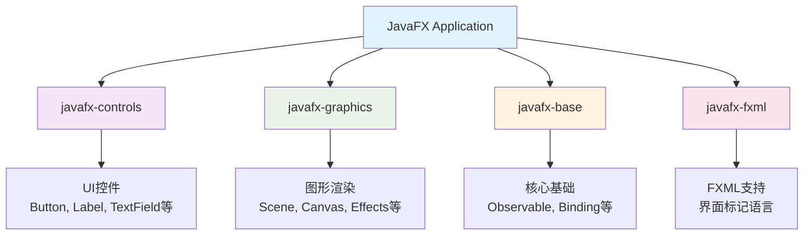
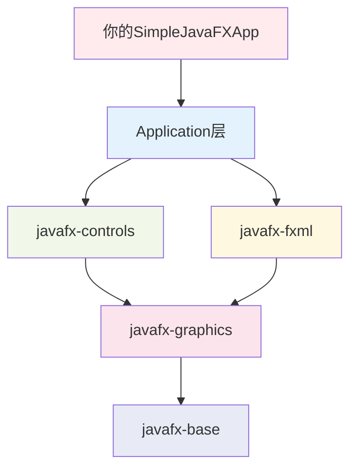

# JavaFx

```mermaid
graph TB
    A[JavaFX Application] --> B[javafx-controls]
    A --> C[javafx-graphics] 
    A --> D[javafx-base]
    A --> E[javafx-fxml]
    
    B --> F[UI控件<br/>Button, Label, TextField等]
    C --> G[图形渲染<br/>Scene, Canvas, Effects等]
    D --> H[核心基础<br/>Observable, Binding等]
    E --> I[FXML支持<br/>界面标记语言]
    
    style A fill:#e1f5fe
    style B fill:#f3e5f5
    style C fill:#e8f5e8
    style D fill:#fff3e0
    style E fill:#fce4ec
```

```mermaid
graph TD
    A[Application层] --> B[javafx-controls]
    A --> C[javafx-fxml] 
    B --> D[javafx-graphics]
    C --> D
    D --> E[javafx-base]
    
    F[你的SimpleJavaFXApp] --> A
    
    style F fill:#ffebee
    style A fill:#e3f2fd
    style B fill:#f1f8e9
    style C fill:#fff8e1
    style D fill:#fce4ec
    style E fill:#e8eaf6
```
