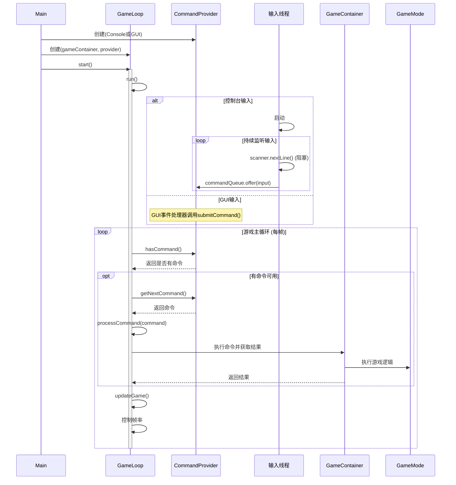

# tmp Note

```mermaid
sequenceDiagram
    participant Main
    participant GameLoop
    participant Provider as CommandProvider
    participant InputThread as 输入线程
    participant GameContainer
    participant GameMode
    
    Main->>Provider: 创建(Console或GUI)
    Main->>GameLoop: 创建(gameContainer, provider)
    Main->>GameLoop: start()
    
    activate GameLoop
    
    GameLoop->>GameLoop: run()
    
    alt 控制台输入
        InputThread->>InputThread: 启动
        loop 持续监听输入
            InputThread->>InputThread: scanner.nextLine() (阻塞)
            InputThread->>Provider: commandQueue.offer(input)
        end
    else GUI输入
        Note over Provider: GUI事件处理器调用submitCommand()
    end
    
    loop 游戏主循环 (每帧)
        GameLoop->>Provider: hasCommand()
        Provider-->>GameLoop: 返回是否有命令
        
        opt 有命令可用
            GameLoop->>Provider: getNextCommand()
            Provider-->>GameLoop: 返回命令
            GameLoop->>GameLoop: processCommand(command)
            GameLoop->>GameContainer: 执行命令并获取结果
            GameContainer->>GameMode: 执行游戏逻辑
            GameContainer-->>GameLoop: 返回结果
        end
        
        GameLoop->>GameLoop: updateGame()
        GameLoop->>GameLoop: 控制帧率
    end
    
    deactivate GameLoop
```