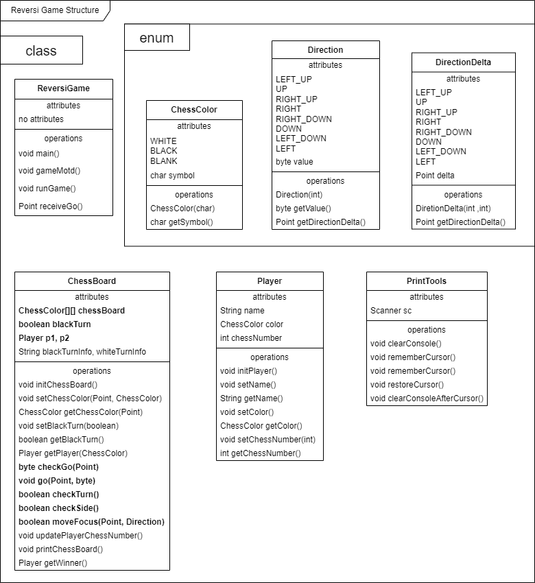
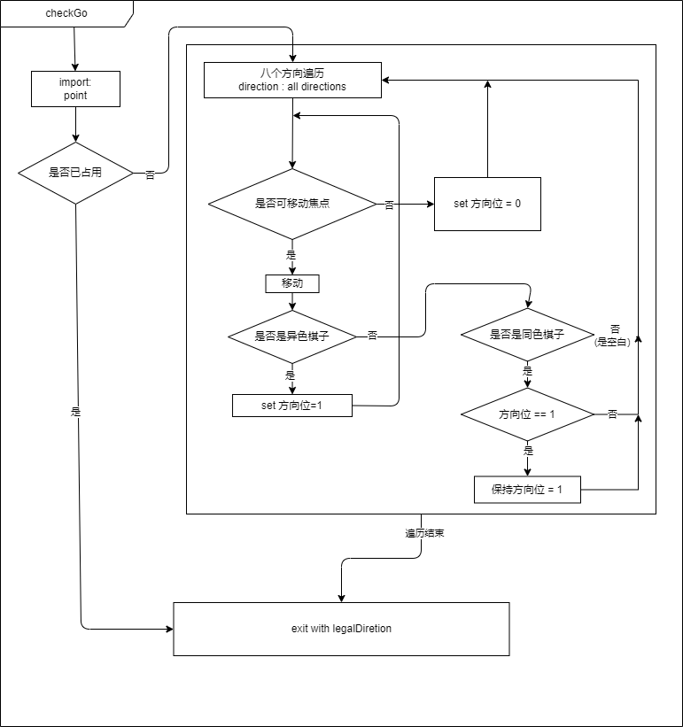
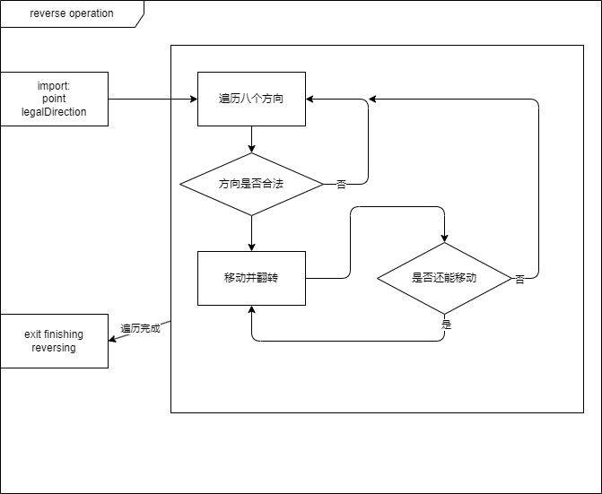
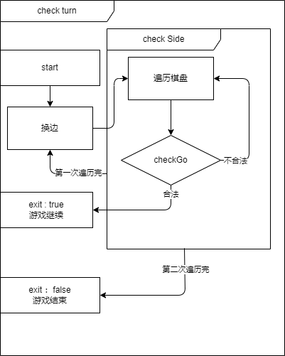

# Reversi Game Ver1.0 : 翻转棋游戏v1.0

- [1. Manual : 游戏说明](#1-manual--游戏说明)
    - [1.1. Start : 开始游戏](#11-start--开始游戏)
    - [1.2. Play and Rule : 游戏流程与规则](#12-play-and-rule--游戏流程与规则)
- [2. Structure of Game Code : 游戏代码结构说明](#2-structure-of-game-code--游戏代码结构说明)
    - [2.1. Basic Design : 基础设计](#21-basic-design--基础设计)
    - [2.2. Important Logic : 重要逻辑](#22-important-logic--重要逻辑)
    - [2.3. Detail Design : 细节设计](#23-detail-design--细节设计)
- [3. Run Test : 运行测试](#3-run-test--运行测试)
    - [3.1. Test Environment : 测试环境](#31-test-environment--测试环境)
    - [3.2. Presentation : 测试展示](#32-presentation--测试展示)

## 1. Manual : 游戏说明

### 1.1. Start : 开始游戏

- `Windows`: 在本目录下运行`startGame.bat`
- `Linux`or`MacOS`等: 先给予运行权限然后在本目录下运行`runGame.sh`(注意，此时默认调用zsh终端)  
    或者直接运行`$yourCLI$ runGame.sh`  
    其中`$yourCLI$`为你的终端命令

### 1.2. Play and Rule : 游戏流程与规则

1. 进入游戏
2. 输入玩家1与玩家2名称，并选择棋子颜色
3. 游戏开始，黑棋先行
4. 合法棋步：
    1. 棋子放置在空格上
    2. 棋子放置后，对方棋子被夹在两个己方棋子之间
    3. 对方被夹住的棋子全部翻转为己方棋子
    4. 轮替：如有合法棋步，必须执行；无合法棋步，弃权
    5. 棋局结束：两方都无合法棋步
5. 输入说明：
    1. 棋子位置：`1A`表示第一行第一列
    2. 输入格式：`{行序号}{列序号}`，如`1A`

## 2. Structure of Game Code : 游戏代码结构说明

本文件包主要包含游戏本体代码，同时保留了部分测试用类  
使用架构：`Maven`

### 2.1. Basic Design : 基础设计

以下图片因导出问题使用`.png`格式，清晰度较低，可以见本目录下同名`.svg`文件  

**Class Structure：**



### 2.2. Important Logic : 重要逻辑

1. **游戏运行主体**

    

2. **判断逻辑**

    

3. **翻转逻辑**

    

4. **判断轮数转换或游戏结束逻辑**

    

### 2.3. Detail Design : 细节设计

1. **legalDirection合法方向记录方法**

    类型：byte
    用法：1个bit表示一个方向是否合法，共8个方向
        `1`表示该方向合法，`0`表示该方向不合法
    顺序：从右到左共8bit位，从左上角开始，顺时针方向依次换位
    辅助实现：通过`Direction`枚举类实现  

    - `Direction`：方向枚举类  
        通过`1<<n`实现，其中`n`为方向编号，可取值`0~7`  

    **操作**

    1. 将某个方向位设为`1`

        ```java
        legalDirection |= Direction.UP.getValue();
        ```

    2. 将某个方向位设为`0`

        ```java
        legalDirection &= ~Direction.UP.getValue();
        ```

    3. 判断某个方向是否合法

        ```java
        if ((legalDirection & Direction.UP.getValue()) != 0) {
            // do something
        }
        ```

2. 定位输出方法  

    于`PrintTools`类中实现，通过ANSI转义码实现  
    因此支持大多数终端（只要终端支持ANSI转义码）  

    参考：
    1. [ANSI转义码](ttps://learnku.com/articles/26231)
    2. [ANSI转移码控制终端输入输出](https://blog.csdn.net/Blaze_dL/article/details/142767515)

## 3. Run Test : 运行测试

### 3.1. Test Environment : 测试环境

- `OS`: Windows 11
- `Java`:  

    ```shell
    java 23.0.2 2025-01-21
    Java(TM) SE Runtime Environment (build 23.0.2+7-58)
    Java HotSpot(TM) 64-Bit Server VM (build 23.0.2+7-58, mixed mode, sharing)
    ```

- `CLI`: PowerShell7

### 3.2. Presentation : 测试展示

1. **游戏开始**

    

2. **玩家定义**

      
      

3. **游戏进行中**

      
      
      

4. **游戏结束**

    
