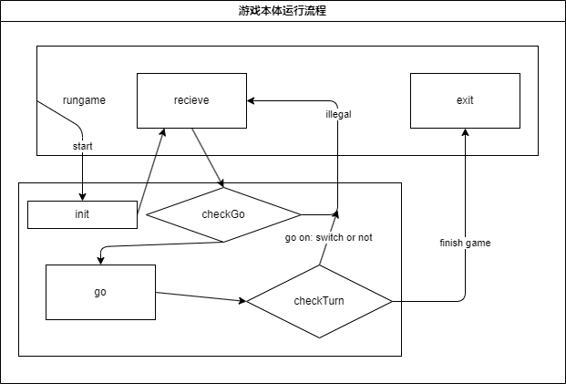

# Lab2 说明文档

## 概览

本次Lab需要实现一个终端黑白棋游戏  

**要求：**  

1. `{stu:id}_{stu:name}_lab2.zip`  
    包含：  
    1. 项目代码  
    2. 实验报告
2. 项目代码：所有lab相关Java源码  
3. 实验报告：  
    1. pdf
    2. 命名格式和zip类似  
        1. 源代码文件名称机器主要功能  
        2. 关键代码及其设计思路  
        3. 运行过程截图和简单说明
4. ddl：`2025/03/12 24:00`

## 背景介绍

### 黑白棋规则

1. 棋盘大小：8*8  
2. 棋子：黑白两色  
3. 开局：
    1. 棋盘中央4个格子放置4个棋子，黑白交替（一般白棋占主对角线）  
    2. 黑棋先行  
4. 合法棋步：  
    1. 棋子放置在空格上
    2. 棋子放置后，对方棋子被夹在两个己方棋子之间
    3. 对方被夹住的棋子全部翻转为己方棋子
5. 轮替：如有合法棋步，必须执行；无合法棋步，弃权  
6. 棋局结束：两方都无合法棋步  

### 打印规格

1. 轴  
    1. 横轴：`A B C D E F G H`  
    2. 纵轴：`1 2 3 4 5 6 7 8`  
2. 棋盘  
    1. 空棋盘：`·`  
    2. 白棋：`●`  
    3. 黑棋：`○`  
3. 玩家信息  
    1. 位置：棋盘右侧  
    2. 格式：`Player: {current_color} {chess_count}`  
        1. `{current_color}`：当前执棋颜色  
        2. `{chess_count}`：当前棋子数量  
4. 对局信息  
    1. 位置：棋盘下方  
    2. 顺序：
        1. 是否有合法棋布等信息  
        2. 当前落子玩家及其颜色  
        3. 提示输入落子  

## 结构设计

### 基础设计

**Class：**  

1. `Player`
    1. instance variable:  
        1. `color`  
        2. `chessCount`  
        3. `
2. `ChessBoard`  
    1. instance variable:  
        1. `chessBoard[][]`: 棋盘
        2. `currentPlayer`  

**runGame:**  



## Release

### v1.0

**总结:**  
实现基本功能，能跑了  

**运行方法:**  

Windows:
运行`runGame.bat`

测试环境

- Windows:  

    1. 使用java版本：  

        ```shell
        java 23.0.2 2025-01-21
        Java(TM) SE Runtime Environment (build 23.0.2+7-58)
        Java HotSpot(TM) 64-Bit Server VM (build 23.0.2+7-58, mixed mode, sharing)
        ```

    2. 执行目录：`Week2`  

        ```shell
        chcp 65001 && & 'java' '-XX:+ShowCodeDetailsInExceptionMessages' '-cp' '.\lab2\target\classes' 'top.thesumst.ReversiGame' 
    

**severe bugs:**  

1. 判断合法棋步似乎有问题  
2. checkSide中出现越界问题  
    具体表现为check到point(0,7)时checkRightDirection时focus(0,8)越界现象  

    ```txt
    start check point:java.awt.Point[x=0,y=7]
    start check direction:LEFT_UP
    0
    start check direction:UP
    0
    start check direction:RIGHT_UP
    0
    start check direction:RIGHT
    focus:java.awt.Point[x=0,y=8]
    Exception in thread "main" java.lang.ArrayIndexOutOfBoundsException: Index 8 out of bounds for length 8
    ```

3. 运行逻辑问题，D3 + E3 后出现 col 3上面全为白子的情况(如下)  
    根据日志分析，应该是checkGo有问题  
    碰见有相邻异色棋子的方向，走到空白处仍然判断为有效方向  

    ```txt
      1 2 3 4 5 6 7 8
    A · · ● · · · · ·
    B · · ● · · · · ·
    C · · ● · · · · · 
    D · · ● ○ ○ · · · 
    E · · ● ○ ● · · ·                          test1 ○ : 3
    F · · · · · · · ·                           test ● : 6
    G · · · · · · · · 
    H · · · · · · · ·
    ```

    ```txt
    2月 28, 2025 5:45:10 下午 top.thesumst.ChessBoard checkGo
    信息: start check point:java.awt.Point[x=4,y=2]
    2月 28, 2025 5:45:10 下午 top.thesumst.ChessBoard checkGo
    信息: start check direction:LEFT_UP
    2月 28, 2025 5:45:10 下午 top.thesumst.ChessBoard moveFocus
    信息: start moveFocus !!!
    2月 28, 2025 5:45:10 下午 top.thesumst.ChessBoard checkGo
    信息: focus:java.awt.Point[x=3,y=1]
    2月 28, 2025 5:45:10 下午 top.thesumst.ChessBoard checkGo
    信息: 0
    2月 28, 2025 5:45:10 下午 top.thesumst.ChessBoard checkGo
    信息: start check direction:UP
    2月 28, 2025 5:45:10 下午 top.thesumst.ChessBoard moveFocus
    信息: start moveFocus !!!
    2月 28, 2025 5:45:10 下午 top.thesumst.ChessBoard checkGo
    信息: focus:java.awt.Point[x=3,y=2]
    2月 28, 2025 5:45:10 下午 top.thesumst.ChessBoard moveFocus
    信息: start moveFocus !!!
    2月 28, 2025 5:45:10 下午 top.thesumst.ChessBoard checkGo
    信息: focus:java.awt.Point[x=2,y=2]
    2月 28, 2025 5:45:10 下午 top.thesumst.ChessBoard checkGo
    信息: 10
    2月 28, 2025 5:45:10 下午 top.thesumst.ChessBoard checkGo
    信息: start check direction:RIGHT_UP
    2月 28, 2025 5:45:10 下午 top.thesumst.ChessBoard moveFocus
    信息: start moveFocus !!!
    2月 28, 2025 5:45:10 下午 top.thesumst.ChessBoard checkGo
    信息: focus:java.awt.Point[x=3,y=3]
    2月 28, 2025 5:45:10 下午 top.thesumst.ChessBoard moveFocus
    信息: start moveFocus !!!
    2月 28, 2025 5:45:10 下午 top.thesumst.ChessBoard checkGo
    信息: focus:java.awt.Point[x=2,y=4]
    2月 28, 2025 5:45:10 下午 top.thesumst.ChessBoard checkGo
    信息: 110
    2月 28, 2025 5:45:10 下午 top.thesumst.ChessBoard checkGo
    信息: start check direction:RIGHT
    2月 28, 2025 5:45:10 下午 top.thesumst.ChessBoard moveFocus
    信息: start moveFocus !!!
    2月 28, 2025 5:45:10 下午 top.thesumst.ChessBoard checkGo
    信息: focus:java.awt.Point[x=4,y=3]
    2月 28, 2025 5:45:10 下午 top.thesumst.ChessBoard moveFocus
    信息: start moveFocus !!!
    2月 28, 2025 5:45:10 下午 top.thesumst.ChessBoard checkGo
    信息: focus:java.awt.Point[x=4,y=4]
    2月 28, 2025 5:45:10 下午 top.thesumst.ChessBoard checkGo
    信息: 1110
    2月 28, 2025 5:45:10 下午 top.thesumst.ChessBoard checkGo
    信息: start check direction:RIGHT_DOWN
    2月 28, 2025 5:45:10 下午 top.thesumst.ChessBoard moveFocus
    信息: start moveFocus !!!
    2月 28, 2025 5:45:10 下午 top.thesumst.ChessBoard checkGo
    信息: focus:java.awt.Point[x=5,y=3]
    2月 28, 2025 5:45:10 下午 top.thesumst.ChessBoard checkGo
    信息: 1110
    2月 28, 2025 5:45:10 下午 top.thesumst.ChessBoard checkGo
    信息: start check direction:DOWN
    2月 28, 2025 5:45:10 下午 top.thesumst.ChessBoard moveFocus
    信息: start moveFocus !!!
    2月 28, 2025 5:45:10 下午 top.thesumst.ChessBoard checkGo
    信息: focus:java.awt.Point[x=5,y=2]
    2月 28, 2025 5:45:10 下午 top.thesumst.ChessBoard checkGo
    信息: 1110
    2月 28, 2025 5:45:10 下午 top.thesumst.ChessBoard checkGo
    信息: start check direction:LEFT_DOWN
    2月 28, 2025 5:45:10 下午 top.thesumst.ChessBoard moveFocus
    信息: start moveFocus !!!
    2月 28, 2025 5:45:10 下午 top.thesumst.ChessBoard checkGo
    信息: focus:java.awt.Point[x=5,y=1]
    2月 28, 2025 5:45:10 下午 top.thesumst.ChessBoard checkGo
    信息: 1110
    2月 28, 2025 5:45:10 下午 top.thesumst.ChessBoard checkGo
    信息: start check direction:LEFT
    2月 28, 2025 5:45:10 下午 top.thesumst.ChessBoard moveFocus
    信息: start moveFocus !!!
    2月 28, 2025 5:45:10 下午 top.thesumst.ChessBoard checkGo
    信息: focus:java.awt.Point[x=4,y=1]
    2月 28, 2025 5:45:10 下午 top.thesumst.ChessBoard checkGo
    信息: 1110
    ```

4. 着棋逻辑有问题  
    初步判断只会执行按照Direction中顺序的第一个合法方向的翻转棋子，以及原位置的着棋子  
    大致定位bug位于`go`或`reverse`方法中  

    before one go :

    ```txt
      1 2 3 4 5 6 7 8
    A · · · · · · · ·
    B · · · · · · · ·
    C · ● · · ○ ● · ·
    D · · ● ○ ○ · · ·
    E · ○ ○ ● ○ ○ · ·                          test1 ○ : 8
    F · · ● ○ ● · · ·                          test2 ● : 7
    G · · ● · · · · ·
    H · · · · · · · ·
    ```

    after go in (3,5):

    ```txt
      1 2 3 4 5 6 7 8
    A · · · · · · · ·
    B · · · · · · · ·
    C · ● · · ○ ● · ·
    D · · ● ○ ○ ● · ·
    E · ○ ○ ● ● ○ · ·                          test1 ○ : 6
    F · · ● ● ● · · ·                          test2 ● : 10
    G · · ● · · · · ·
    H · · · · · · · ·
    ```

    可以发现只有LEFT_DOWN方向的棋子发生翻转，但LEFT同为合法方向，并没有翻转  

    ```txt
    2月 28, 2025 6:50:52 下午 top.thesumst.ChessBoard checkGo
    信息: 110
    2月 28, 2025 6:50:52 下午 top.thesumst.ChessBoard go
    信息: start check go !!!
    2月 28, 2025 6:50:52 下午 top.thesumst.ChessBoard go
    信息: start revers chesses in direction:UP
    2月 28, 2025 6:50:52 下午 top.thesumst.ChessBoard moveFocus
    信息: start moveFocus !!!
    2月 28, 2025 6:50:52 下午 top.thesumst.ChessBoard moveFocus
    信息: start moveFocus !!!
    2月 28, 2025 6:50:52 下午 top.thesumst.ChessBoard go
    信息: start revers chesses in direction:RIGHT_UP
    2月 28, 2025 6:50:52 下午 top.thesumst.ChessBoard checkSide
    信息: start checkSide !!!
    ```

**bugs:**  

1. 棋盘打印有问题：玩家位置输出在D、E行，应该在C、D行
2. 中文玩家名似乎有问题

**change:**  

1. 一开始行为字母，列为数字，后根据文档要求调换

**expected features:**

1. 优化打印格式
2. 彩色打印
3. 更合理的MOTD
4. 更合理的输入提示
5. 仅当前轮次选手显示棋子

- [x] 修复合法棋步判断
- [x] 修复checkSide越界问题
- [x] 修复玩家信息输出位置
- [x] 修复中文玩家名问题(in Windows)
    (通过命令执行前加上`chcp 65001`解决)
- [ ] 优化打印格式
- [ ] 更合理的MOTD
- [x] 更合理的输入提示
- [ ] 彩色打印
