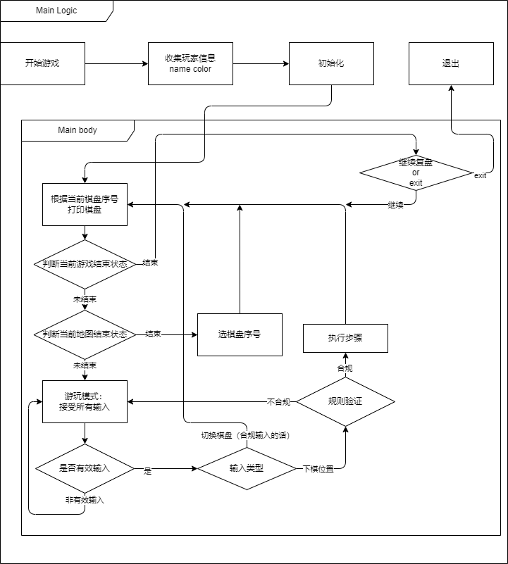

# Reversi Game Ver2.0 : 翻转棋游戏v2.0

## 1. Manual : 游戏说明

### 1.1. Start : 开始游戏

- `Windows`: 在本目录下运行`startGame.bat`
- `Linux`or`MacOS`等: 先给予运行权限然后在本目录下运行`runGame.sh`(注意，此时默认调用zsh终端)  
    或者直接运行`$yourCLI$ runGame.sh`  
    其中`$yourCLI$`为你的终端命令

### 1.2. Play and Rule : 游戏流程与规则

1. 进入游戏
2. 输入玩家1与玩家2名称，并选择棋子颜色
3. 游戏开始，黑棋先行
4. 合法棋步：
    1. 棋子放置在空格上
    2. 棋子放置后，对方棋子被夹在两个己方棋子之间
    3. 对方被夹住的棋子全部翻转为己方棋子
    4. 轮替：如有合法棋步，必须执行；无合法棋步，弃权
    5. 当前棋盘棋局结束：两方都无合法棋步
    6. 游戏结束：当所有棋盘游戏结束后，可以选择退出
5. 输入说明：
    1. 棋子位置：`1A`表示第一行第一列
    2. 输入格式：`{行序号}{列序号}`，如`1A`
    *注：现在支持乱序输入和大小写兼容*  
    3. 换棋盘：输入合法棋盘序号（目前支持3棋盘，即1-3中的一个数字）  
    4. 退出游戏：当所有棋盘游戏结束后，可以选择输入`exit`退出游戏

## 2. Changelog of Ver2.0 : v2.0更新内容

### 2.1. New Features : 新增功能

- 多棋盘游戏
    - 支持输入棋盘序号，切换棋盘
- 更好的支持输入
    - 顺序可乱，大小写支持
    - 支持换棋盘的输入

### 2.2. Structure Change : 结构变化

1. 将接受输入的功能从`ReversiGame`中分离出来  
    新增一个类`ReceiveTools`用于集中处理输入  
2. 修改了`ChessBoard`和`Player`的初始化方法  
    为了配合多棋盘的模式，采用了外部收集`Player`信息并统一传入的方式
3. 将游戏启动方法从`ReversiGame`中分离出来  
    新增一个类`GameStart`用于启动游戏
4. `ReversiGame`中棋盘主体的持有方式发生改变  
    由原先的`runGame`方法持有变为`ReversiGame`的实例变量持有

### 2.3. Bug Fix : Bug修复

修缮了一些Ver1.0中未发现的严重bug

1. 棋子颜色选择异常输入（非纯数字字符串）导致程序崩溃  
2. 游戏中空输入导致的程序崩溃  

此外一些新开发造成的大小bug（目前已经发现的）也被修复  
详情可见[lab3.md](./lab3.md#bug-fix)  

## 3. Ver2.0 Detail Design : v2.0细节设计

### 3.1. New Main Body Logic : 新游戏主体逻辑

  

### 4.2. Presentation : 测试展示

1. 玩家信息初始化实例  

      
      

2. 游戏开始

      
    

3. 切换棋盘

      
      
    
