# Reversi Game Ver2.0 : 翻转棋游戏v2.0

## 1. Manual : 游戏说明

### 1.1. Start : 开始游戏

```bash
java -jar ./target/lab3-3.0.jar
```

### 1.2. Play and Rule : 游戏流程与规则

1. 进入游戏
2. 输入玩家1与玩家2名称，并选择棋子颜色
3. 游戏开始，黑棋先行
4. 游戏模式：  
    1. `peace` ：和平模式  
        无规则，不可重复，下满结束
    2. `reversi` : 翻转棋模式  
        标准翻转棋规则  
5. `reversi`规则说明：  
    1. 棋子放置在空格上
    2. 棋子放置后，对方棋子被夹在两个己方棋子之间
    3. 对方被夹住的棋子全部翻转为己方棋子
    4. 轮替：如有合法棋步，必须执行；无合法棋步，输入`pass`跳过
    5. 当前棋盘棋局结束：两方都无合法棋步
    6. 游戏结束：当所有棋盘游戏结束后，可以选择退出
6. 输入说明：
    1. 棋子位置：`1A`表示第一行第一列
    2. 输入格式：`{行序号}{列序号}`，如`1A`
        *注：现在支持乱序输入和大小写兼容*  
    3. 新建棋盘: `peace`/`reversi`创建对应模式的新棋盘  
        目前限制最大同时与你先运行棋盘数为8  
    4. 切换棋盘: 输入对应棋盘序号，切换到对应棋盘
    5. 退出游戏: 可以选择输入`quit`退出游戏

## 2. Changelog of Ver3.0 : v3.0更新内容

### 2.1. New Features : 新增功能

1. 新增多游戏模式选择：  
    1. `peace`
    2. `reversi`
2. 新增新建棋盘功能：  
    输入对应模式名称，可以新建一个对应模式的棋盘  
    限制最大同时与你先运行棋盘数为8  
3. `reversi`模式添加合法位置预览功能：  
    棋盘上，当前回合玩家可以下棋的合法位置会被标记出来  
    标记符号为`+`  
4. `pass`功能：  
    `reversi`模式下，回合更换逻辑变换  
    新增`pass`用于处理某一方无合法棋步的情况  
    此时需要主动输入`pass`，以转换回合  
    （此功能不太合理，仅为满足暂时需求，后续或将抛弃）  
5. `quit`功能：  
    对原有的游戏结束逻辑进行更改  
    现改为随时可以输入`quit`退出游戏，不再需要等待所有棋盘结束  
6. 更优秀显示布局：  
    更加直观的合理的页面布局  
    更加详细的输入提示  
    展示：  

    ```txt
    A B C D E F G H
    1 · · · · · · · ·
    2 · · · · · · · ·                                            ==========================
    3 · · · + · · · ·                                              1. peace
    4 · · + ● ○ · · ·    [Player1]test1      ○ : 2               > 2. reversi
    5 · · · ○ ● + · ·    [Player2]test2      ● : 2
    6 · · · · + · · ·
    7 · · · · · · · ·                                            ==========================
    8 · · · · · · · ·

    当前回合: test1 ○ :


    请输入命令:
    1. 坐标[1A-8H](支持大小写+乱序)
    2. 切换棋盘[1-2]
    3. 跳过(pass)
    4. 增加棋盘(peace/reversi)
    5. 退出游戏(quit)
    ```

7. 更优秀的错误处理：  
    现在大部分的输入会有更加详细的结果提示  

## 3. Project Structure : 项目结构

**本次更新对于内核进行了彻底重构**  

结构展示:  

```txt
top.thesumst
├──container
│  ├──GameContainer.java
│  ├──GameContainerTestDrive.java
│  └──GameList.java
├──mode
│  ├──component
│  │  ├──ChessBoard.java
│  │  └──Player.java
│  ├──GameMode.java
│  ├──PeaceMode.java
│  └──ReversiMode.java
├──tools
│  ├──command
│  │  ├──CommandFactory.java
│  │  ├──CommandResult.java
│  │  ├──GameCommand.java
│  │  ├──GoCommand.java
│  │  ├──NewGameCommand.java
│  │  ├──PassCommand.java
│  │  ├──QuitCommand.java
│  │  └──SwitchBoardCommand.java
│  ├──input
│  │  ├──InputParser.java
│  │  ├──InputResult.java
│  │  └──InputType.java
│  ├──PauseTools.java
│  ├──PrintTools.java
│  └──ReceiveTools.java
├──type
│  ├──ChessColor.java
│  └──Direction.java
└──Main.java
```

### 3.1. Introduction to Structure : 结构说明

总体来说项目依然包含在`top.thesumst`包下  
此次采用了更为细致的模块划分  
将游戏的逻辑部分与工具部分进行了分离  
采用`package`进行子模块划分  

- `Main.java` : 游戏启动类
- `container` : 游戏容器模块
    - `GameContainer.java` : 游戏容器类
    - `GameContainerTestDrive.java` : 游戏容器测试类
    - `GameList.java` : 游戏列表类
- `mode` : 游戏模式模块
    - `component` : 游戏模式组件
        - `ChessBoard.java` : 棋盘类
        - `Player.java` : 玩家类
    - `GameMode.java` : 游戏模式抽象类
    - `PeaceMode.java` : 和平模式类
    - `ReversiMode.java` : 翻转棋模式类
- `tools` : 工具模块
    - `command` : 命令模块
        - `CommandFactory.java` : 命令工厂类
        - `CommandResult.java` : 命令结果类
        - `GameCommand.java` : 游戏命令抽象类
        - `GoCommand.java` : 下棋命令类
        - `NewGameCommand.java` : 新建棋盘命令类
        - `PassCommand.java` : 跳过命令类
        - `QuitCommand.java` : 退出命令类
        - `SwitchBoardCommand.java` : 切换棋盘命令类
    - `input` : 输入模块
        - `InputParser.java` : 输入解析类
        - `InputResult.java` : 输入结果类
        - `InputType.java` : 输入类型枚举类
    - `PauseTools.java` : 暂停工具类
    - `PrintTools.java` : 打印工具类
    - `ReceiveTools.java` : 接收工具类
- `type` : 类型模块
    - `ChessColor.java` : 棋子颜色枚举类
    - `Direction.java` : 方向枚举类

## 4. Ver2.0 Detail Design : v2.0细节设计

### 4.1. New Main Body Logic : 新游戏主体逻辑

这一版本我们对游戏进行了全面重构，采用了更为合理的设计模式，下面是游戏主要类的UML类图：  

```mermaid
classDiagram
    %% 主要容器类
    class GameContainer {
        -GameList gameList
        -boolean isRunning
        -static int currentGameOrder
        +GameContainer()
        +runGame()
        +static switchGameOrder(int)
        +static getCurrentGameOrder()
        +getGameList()
        -handleCommandResult(CommandResult)
    }
    
    class GameList {
        -static int gameNumber
        -List~GameMode~ games
        -static String player1Name, player2Name
        -static ChessColor player1Color, player2Color
        +GameList()
        +boolean addGame(String)
        +GameMode getGame(int)
        +static int getGameNumber()
        -setInitializeInfo()
    }
    
    %% 游戏模式类
    class GameMode {
        #final int gameOrder
        #final String gameMode
        #final int maxSize
        #ChessBoard board
        #Player player1, player2
        #boolean isBlackTurn, isOver
        #GameMode(int, String, int, String, String, ChessColor, ChessColor)
        +abstract boolean receiveOperation(Point)
        +abstract boolean receiveOperation(String)
        +String toString()
        +int getSize()
        +String getGameMode()
        +boolean isOver()
        +boolean isBlackTurn()
        +Player getPlayer1()
        +Player getPlayer2()
        +Player getCurrentPlayer()
        +ChessBoard getBoard()
    }
    
    class PeaceMode {
        +PeaceMode(int, String, int, String, String, ChessColor, ChessColor)
        +boolean receiveOperation(Point)
        +boolean receiveOperation(String)
        -boolean go(Point)
        -boolean checkPoint(Point)
        -boolean checkGameOver()
    }
    
    class ReversiMode {
        -Map~Point, Byte~ validPointsCache
        -boolean shouldPass
        +ReversiMode(int, String, int, String, String, ChessColor, ChessColor)
        +boolean receiveOperation(Point)
        +boolean receiveOperation(String)
        +boolean shouldPass()
        +Player getWinner()
        -boolean go(Point)
        -boolean checkGo(Point)
        -byte checkPoint(Point)
        -void refreshValidPoints()
        -void clearValidPointsHint()
        -void refreshValidPointsHint()
        -void reverse(Point, byte)
        -boolean moveFocus(Point, Direction)
        -void updatePlayerChessNumber()
        -void checkGameOver()
        -ChessColor getChessColor(Point)
        -void setChessColor(Point, ChessColor)
    }
    
    class ChessBoard {
        -ChessColor[][] chessBoard
        -final int size
        +ChessBoard(int)
        +void setChessColor(Point, ChessColor)
        +ChessColor getChessColor(Point)
        +int getChessNumber(ChessColor)
    }
    
    class Player {
        -String name
        -ChessColor color
        -int chessNumber
        +Player(String, ChessColor)
        +String getName()
        +ChessColor getColor()
        +void setChessNumber(int)
        +int getChessNumber()
    }
    
    %% 命令模式相关类
    class GameCommand {
        <<interface>>
        +CommandResult execute(GameMode, GameList)
    }
    
    class CommandFactory {
        +static GameCommand createCommand(InputResult)
    }
    
    class CommandResult {
        -boolean success
        -String message
        -boolean shouldRefreshDisplay
        -boolean shouldQuit
        -CommandResult(boolean, String, boolean, boolean)
        +static CommandResult success()
        +static CommandResult success(String)
        +static CommandResult failure(String)
        +static CommandResult quit()
        +boolean isSuccess()
        +String getMessage()
        +boolean shouldRefreshDisplay()
        +boolean shouldQuit()
    }
    
    class GoCommand {
        -Point position
        +GoCommand(Point)
        +CommandResult execute(GameMode, GameList)
    }
    
    class PassCommand {
        +CommandResult execute(GameMode, GameList)
    }
    
    class QuitCommand {
        +CommandResult execute(GameMode, GameList)
    }
    
    class NewGameCommand {
        -String gameType
        +NewGameCommand(String)
        +CommandResult execute(GameMode, GameList)
        +String getGameType()
    }
    
    class SwitchBoardCommand {
        -int boardNumber
        +SwitchBoardCommand(int)
        +CommandResult execute(GameMode, GameList)
        +int getBoardNumber()
    }
    
    %% 输入处理相关类
    class InputParser {
        -static Pattern CHESS_POSITION
        -static Pattern BOARD_NUMBER
        -static Pattern COMMAND_PATTERN
        -static int boardSize
        +static void setBoardSize(int)
        +static InputResult parse(String)
        -static boolean isValidPosition(Point)
        -static Point parsePosition(Matcher)
    }
    
    class InputResult {
        -InputType type
        -Object data
        -InputResult(InputType, Object)
        +static InputResult chessMove(Point)
        +static InputResult switchBoard(int)
        +static InputResult newGame(String)
        +static InputResult pass()
        +static InputResult quit()
        +static InputResult invalid()
        +InputType getType()
        +T getDataAs(Class~T~)
        +Point getPosition()
        +int getBoardNumber()
        +String getGameType()
        +String toString()
    }
    
    class InputType {
        <<enumeration>>
        CHESS_MOVE
        SWITCH_BOARD
        NEW_GAME
        PASS
        QUIT
        INVALID
    }
    
    %% 工具类
    class ReceiveTools {
        -PrintTools printTools
        +ReceiveTools()
        +CommandResult receiveAndExecuteCommand(GameMode, GameList)
        -InputResult receiveInput(GameMode, GameList)
    }
    
    class PrintTools {
        +Scanner sc
        +static void initializePositionsSet(GameMode)
        +static void printBoard(GameMode)
        +static void printPlayerInfo(GameMode)
        +static void printGameList(GameList)
        +static void printInputPanel(GameList)
        +static void clearConsole()
        +static void rememberCursor()
        +static void restoreCursor()
        +static void clearConsoleAfterCursor()
        +static void goToResultPosition()
    }
    
    class PauseTools {
        +static void pause()
        +static void pause(String)
    }
    
    class ChessColor {
        <<enumeration>>
        WHITE
        BLACK
        BLANK
        VALID
        -char symbol
        +char getSymbol()
    }
    
    class Direction {
        <<enumeration>>
        UP
        DOWN
        LEFT
        RIGHT
        UP_LEFT
        UP_RIGHT
        DOWN_LEFT
        DOWN_RIGHT
        -byte value
        +byte getValue()
        +static Point getDirectionDelta(Direction)
    }
    
    %% 关系定义
    GameContainer --> GameList : contains
    GameList "1" --> "*" GameMode : manages
    
    GameMode <|-- PeaceMode : extends
    GameMode <|-- ReversiMode : extends
    GameMode --> ChessBoard : has
    GameMode --> Player : has
    
    GameContainer --> ReceiveTools : uses
    ReceiveTools --> PrintTools : uses
    ReceiveTools --> CommandFactory : uses
    
    CommandFactory --> GameCommand : creates
    GameCommand <|.. GoCommand : implements
    GameCommand <|.. PassCommand : implements
    GameCommand <|.. QuitCommand : implements
    GameCommand <|.. NewGameCommand : implements
    GameCommand <|.. SwitchBoardCommand : implements
    
    GoCommand --> CommandResult : produces
    PassCommand --> CommandResult : produces
    QuitCommand --> CommandResult : produces
    NewGameCommand --> CommandResult : produces
    SwitchBoardCommand --> CommandResult : produces
    
    InputParser --> InputResult : produces
    InputResult --> InputType : uses
    CommandFactory --> InputResult : uses
    
    ChessBoard --> ChessColor : uses
    Player --> ChessColor : has
    ReversiMode --> Direction : uses
```



几个主要模块：

1. **容器模块**：GameContainer 和 GameList 负责管理多个游戏实例
2. **游戏模式模块**：GameMode 作为抽象基类，PeaceMode 和 ReversiMode 作为具体实现
3. **命令模式**：通过 GameCommand 接口和具体命令类实现了命令模式
4. **输入处理模块**：InputParser 和 InputResult 处理用户输入
5. **工具类**：PrintTools 和 PauseTools 提供辅助功能

多种设计模式：

- **命令模式**：将用户操作封装成命令对象
- **工厂模式**：通过 CommandFactory 创建命令
- **单例模式**：部分工具类采用静态方法
- **模板方法模式**：GameMode 定义了游戏流程，具体实现由子类完成

### 4.2. Command Pattern Implementation : 命令模式实现

命令模式是本次重构的核心设计模式之一，它允许我们将用户操作封装成对象，使得操作可以被参数化、排队和撤销。

1. GameCommand 接口定义了命令的执行方法
2. 各种具体命令类实现了不同的操作
3. CommandFactory 根据用户输入创建对应的命令
4. ReceiveTools 负责获取输入并执行命令

这种设计使得我们可以轻松地扩展新的命令，而不需要修改现有代码，符合开闭原则。

#### 4.2.1. Input Parser : 输入解析器

使用正则表达式匹配用户输入  
对匹配的结果进行解析  
使用`InputParser`类对用户输入进行解析  
根据输入内容返回对应的`InputResult`对象  

#### 4.2.2. Command Factory : 命令工厂

使用`CommandFactory`类  
根据`InputResult`对象创建对应的`GameCommand`对象  

#### 4.2.3. Command Execution : 命令执行

使用`GameCommand`接口  
定义了命令的执行方法  
由其具体实现类执行对应的操作  
并返回`CommandResult`对象  

#### 4.2.4. Command Result Handle : 命令结果处理

`CommandResult`对象包含了命令执行的结果  
包括是否成功、提示信息、是否需要刷新显示、是否需要退出游戏  
目前主要用于处理结果显示  
(部分信息在当前版本中未使用，留作后续拓展)  

### 4.3. Multi-Mode Realized By Extension Of Abstract Class : 抽象类继承实现多模式

`GameMode`抽象类  
定义了游戏模式的基本属性和方法  
使用`PeaceMode`和`ReversiMode`继承实现具体的游戏模式  

#### 4.3.1. Basic Structure Change : 基本结构调整

同时，对于底层构建也进行了调整  
原本为`ChessBoard`包含`Player`  
现改为`GameMode`包含`ChessBoard`和`Player`  
更加直观而合理的逻辑结构  

同时对于`ChessBoard`的构建进行了调整  
去除了硬编码的大小限制，改为动态设置  
为后续拓展非固定大小棋盘做准备  

#### Container Module : 容器模块

使用`GameContainer`类作为游戏运行容器  
引入`GameList`类，用于管理多个游戏实例  

借助抽象类`GameMode`  
在`GameList`中可以同一管理不同的游戏模式  
两种模式的大部分共同功能在`GameMode`中实现  
或者是在`GameMode`中作为抽象方法，由具体模式实现  

由于实现需要，少部分`ReversiMode`独有方法  
借助`GameMode`中的`gameMode`属性进行判断并向下转型  
再对方法进行调用  

### 4.4. Output Optimization : 输出优化

对于输出进行了优化  
此次主要优化了输出的布局  

将输出模块进行了彻底的重构  
游戏中的输出将全部由`PrintTools`类进行  
对输出功能进行了模块化处理  
各个模块间可以不受影响的进行分别输出  
同时，输出位置可以根据棋盘大小进行调整  

除此之外还有更详细和更合理的输出提示  
对于不同的情况，提示会有所不同  
对于对局结束，也会有相应的信息显示  

#### 4.4.1. Output Principle : 输出原理

引入`OutputPositionsSet`类  
采用字符串拼接得到相应的ANSI转义序列  
并编写对应辅助方法用于移动光标达到指定位置输出  

## 5. Presentation : 测试展示

由于先前对开始初始化部分进行了展示，此处不多赘述  
直接从游戏内容界面开始展示  

### Peace Mode : 和平模式

  
  
  

### Reversi Mode : 翻转棋模式

  
  
  
  
  
  

### Switch Game : 切换游戏

  
  

### Create New Game : 新建游戏

  
  
  

### Quit Game : 退出游戏

  
