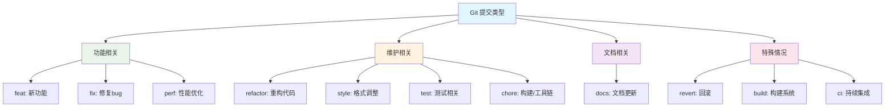

# Conventional Commits

## Basic

```mermaid
graph TD
    A[Git 提交类型] --> B[功能相关]
    A --> C[维护相关]
    A --> D[文档相关]
    A --> E[特殊情况]
    
    B --> B1[feat: 新功能]
    B --> B2[fix: 修复bug]
    B --> B3[perf: 性能优化]
    
    C --> C1[refactor: 重构代码]
    C --> C2[style: 格式调整]
    C --> C3[test: 测试相关]
    C --> C4[chore: 构建/工具链]
    
    D --> D1[docs: 文档更新]
    
    E --> E1[revert: 回滚]
    E --> E2[build: 构建系统]
    E --> E3[ci: 持续集成]
    
    style A fill:#e1f5fe
    style B fill:#e8f5e8
    style C fill:#fff3e0
    style D fill:#f3e5f5
    style E fill:#fce4ec
```
