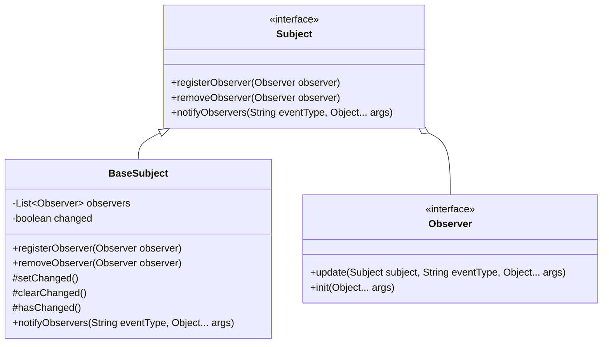
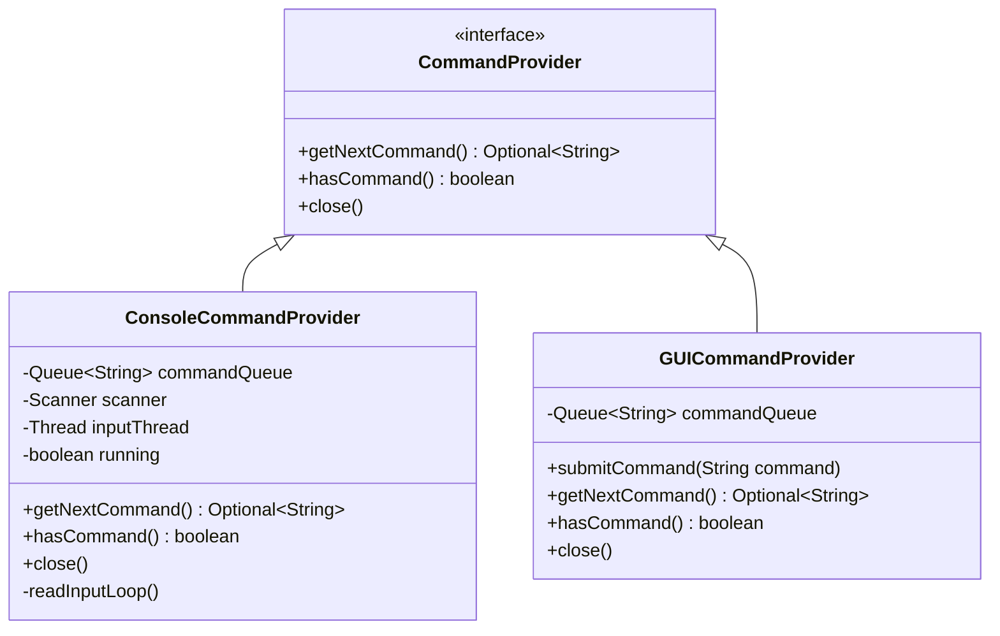
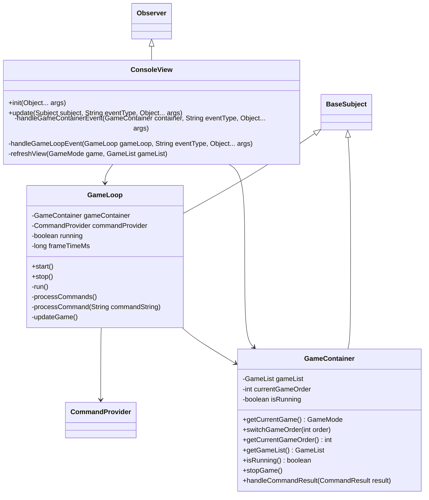
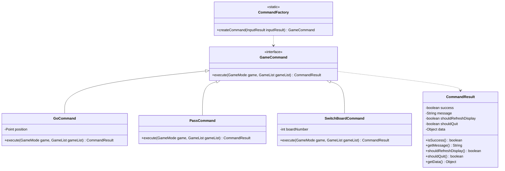

# 项目结构 UML 图

## 观察者模式

```mermaid
classDiagram
    class Subject {
        <<interface>>
        +registerObserver(Observer observer)
        +removeObserver(Observer observer)
        +notifyObservers(String eventType, Object... args)
    }
    
    class Observer {
        <<interface>>
        +update(Subject subject, String eventType, Object... args)
        +init(Object... args)
    }
    
    class BaseSubject {
        -List~Observer~ observers
        -boolean changed
        +registerObserver(Observer observer)
        +removeObserver(Observer observer)
        #setChanged()
        #clearChanged()
        #hasChanged()
        +notifyObservers(String eventType, Object... args)
    }
    
    Subject <|-- BaseSubject
    Subject o-- Observer
```

## 命令提供者架构

```mermaid
classDiagram
    class CommandProvider {
        <<interface>>
        +getNextCommand() Optional~String~
        +hasCommand() boolean
        +close()
    }
    
    class ConsoleCommandProvider {
        -Queue~String~ commandQueue
        -Scanner scanner
        -Thread inputThread
        -boolean running
        +getNextCommand() Optional~String~
        +hasCommand() boolean
        +close()
        -readInputLoop()
    }
    
    class GUICommandProvider {
        -Queue~String~ commandQueue
        +submitCommand(String command)
        +getNextCommand() Optional~String~
        +hasCommand() boolean
        +close()
    }
    
    CommandProvider <|-- ConsoleCommandProvider
    CommandProvider <|-- GUICommandProvider
```

## 游戏循环和视图

```mermaid
classDiagram
    class GameLoop {
        -GameContainer gameContainer
        -CommandProvider commandProvider
        -boolean running
        -long frameTimeMs
        +start()
        +stop()
        -run()
        -processCommands()
        -processCommand(String commandString)
        -updateGame()
    }
    
    class ConsoleView {
        +init(Object... args)
        +update(Subject subject, String eventType, Object... args)
        -handleGameContainerEvent(GameContainer container, String eventType, Object... args)
        -handleGameLoopEvent(GameLoop gameLoop, String eventType, Object... args)
        -refreshView(GameMode game, GameList gameList)
    }
    
    class GameContainer {
        -GameList gameList
        -int currentGameOrder
        -boolean isRunning
        +getCurrentGame() GameMode
        +switchGameOrder(int order)
        +getCurrentGameOrder() int
        +getGameList() GameList
        +isRunning() boolean
        +stopGame()
        +handleCommandResult(CommandResult result)
    }
    
    BaseSubject <|-- GameLoop
    BaseSubject <|-- GameContainer
    Observer <|-- ConsoleView
    GameLoop --> CommandProvider
    GameLoop --> GameContainer
    ConsoleView --> GameLoop
    ConsoleView --> GameContainer
```

## 命令模式

```mermaid
classDiagram
    class GameCommand {
        <<interface>>
        +execute(GameMode game, GameList gameList) CommandResult
    }
    
    class CommandResult {
        -boolean success
        -String message
        -boolean shouldRefreshDisplay
        -boolean shouldQuit
        -Object data
        +isSuccess() boolean
        +getMessage() String
        +shouldRefreshDisplay() boolean
        +shouldQuit() boolean
        +getData() Object
    }
    
    class CommandFactory {
        <<static>>
        +createCommand(InputResult inputResult) GameCommand
    }
    
    class GoCommand {
        -Point position
        +execute(GameMode game, GameList gameList) CommandResult
    }
    
    class PassCommand {
        +execute(GameMode game, GameList gameList) CommandResult
    }
    
    class SwitchBoardCommand {
        -int boardNumber
        +execute(GameMode game, GameList gameList) CommandResult
    }
    
    GameCommand <|-- GoCommand
    GameCommand <|-- PassCommand
    GameCommand <|-- SwitchBoardCommand
    GameCommand ..> CommandResult
    CommandFactory ..> GameCommand
```
