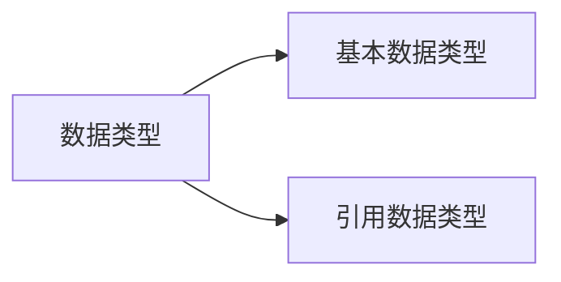

# 基础语法和规范

- [1. 源程序的组成部分](#1-源程序的组成部分)
    - [1.1. 命名方式:标识符(偏补充)](#11-命名方式标识符偏补充)
    - [1.2. 字面值](#12-字面值)
    - [1.3. 变量(偏补充)](#13-变量偏补充)
- [2. java的数据类型](#2-java的数据类型)
    - [2.1. 基本数据类型](#21-基本数据类型)
    - [2.2. 引用数据类型](#22-引用数据类型)
    - [2.3. 字面值的数据类型](#23-字面值的数据类型)
    - [2.4. 数据类型转换](#24-数据类型转换)
- [3. java的运算符](#3-java的运算符)
- [4. java的控制语句](#4-java的控制语句)

## 1. 源程序的组成部分

### 1.1. 命名方式:标识符(偏补充)

和C差不多,但允许的组成字符多了`$`  

**命名规范补充:**  

- 包名:全部小写字母
- 类名:首字母大写,驼峰命名法
- 方法名&变量名:首字母小写,驼峰命名法
- 尽量采用完整的描述性单词命名,不要使用缩写
- 此外,不要使用Java已经定义的类名作为标识符

### 1.2. 字面值

[constTest](../1_code/1_1_basicGrammar/constTest.java)  
java中`常量`概念有新的用法,原来C中的`常量`概念在这里叫`字面值`  

### 1.3. 变量(偏补充)

[varianceTest](../1_code/1_1_basicGrammar/varianceTest.java)  

1. 变量的组成结构:

    ```mermaid
    graph LR
        变量-->数据类型
        变量-->标识符
        变量-->字面值
    ```

2. 相关概念理解补充:
    `数据类型`的作用:指导程序在运行阶段的对内存空间分配的大小  

3. **补充注意**:  
    java中要求:  
    1. 变量**只能**存储对应数据类型的字面值  
    2. 变量在声明后必须进行初始化才可以访问

4. 变量的类型  
    相比C而言,OOP的`class`中多了一种概念叫做`成员变量`  
    `成员函数`(也是`struct`中所没有的)调用`成员变量`,不必按照上下顺序(也就是使用的可以是在编写顺序上在函数之后定义的变量)  
    `成员变量`可以初始化(相对应的C中`struct`是不可以初始化的)  

## 2. java的数据类型



### 2.1. 基本数据类型

1. `整数型`:
   1. `byte` 1B  
   2. `short` 2B  
   3. `int` 4B  
   4. `long` 8B  
2. `浮点型`:
   1. `float` 4B  
   2. `double` 8B  
3. `布尔型`
   1. `boolean` 1B  
    *这里和C++用`bool`表示是不一样的*
4. `字符型`
   1. `char` 2B  
    *这里也和C/C++的`char`是1B不一样*

### 2.2. 引用数据类型

暂且先不多讲,只列一些常见部分:

1. `类`
2. `接口`
3. `数组`
4. 等等

*字符串属于引用数据类型*  

### 2.3. 字面值的数据类型

**字面值(literal):**  
程序中直接出现的常量值  

1. `整数型`默认为`int`  
    若要作为`long`类型,须在尾部加上`l`or`L`,推荐使用`L`  
2. `浮点型`默认为`double`  
    若要作为`float`类型,须在尾部加上`f`or`F`  

**命名常量(named constant):**  
表示一个代表不变值的标识符,也简称为常量  
可以理解为用来存储字面值的变量,其值在程序运行时不会改变  

```java
final int MAX_VALUE = 100;
```

- 命名规范:常量名全部大写,单词之间用下划线分隔
- 优点:  
    - 代码编写更简单,且易读  
    - 便于维护,只需要修改常量的值即可,不需要修改所有引用该常量的地方  

### 2.4. 数据类型转换

相关具体测试可以参考下述源文件  
[constAndVarTest](../1_code/1_1_basicGrammar/constAndVarTypeTest.java)  

依然和C/C++类似  
具有两种类型:  

1. 自动类型转换  
    由低到高: `byte` < `char/short` < `int` < `long` < `float` < `double`  
    计算时会先将低容量类型数据转换为高容量类型数据,再进行计算  
    注意:`byte`,`char`,`short`之间进行运算都会先转换成`int`类型  
2. 强制类型转换  
    java中,从高到低转换,必需要强制类型转换运算符  
    可能会丢失精度,慎用  

注意: 8种基本数据类型中,`boolean`类型不能和其他类型之间进行转换  

## 3. java的运算符

java操作运算符演示:  
[operatorTest](../1_code/1_1_basicGrammar/operatorTest.java)  

大部分还是与C/C++一致  
但是细节上有些略微不同  

由于java中`boolean`类型的严格独立,java的逻辑运算符对于操作数的要求也更为严格  
*逻辑运算符即`&&` , `||` , `!`*  
逻辑运算符得操作数必须全都为`boolean`类型,最后得到的也是`boolean`类型的值  
(C没有`bool`基础类型,C++的`bool`中`true`/`false`基本上可以认为是`1`/`0`)  

*表达式概念补充:*  
**表达式**表示包含值、变量、运算符的一次运算过程,结合在一起得出一个值  

## 4. java的控制语句

和C/C++大体上一致  

注意点:  

1. `switch`的输入值和`case`后面的类型都只能是`int`与`String`类型的数据(`case`后面的只能是字面值常量)  
    此处`switch`中对于`String`类型的处理能力是C++所不具有的  
    注: `byte` , `short` , `char` 会自动转换为 `int`  
2. 同时和逻辑运算符相类似的,条件和循环的控制语句中也必须是`boolean`类型的值  
