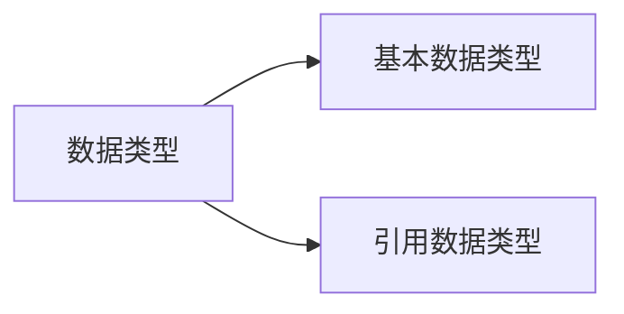

# 基础语法和规范 2025.1.7

- [1. 源程序的组成部分](#1-源程序的组成部分)
  - [1.1. 命名方式:标识符(偏补充)](#11-命名方式标识符偏补充)
  - [1.2. 字面值](#12-字面值)
  - [1.3. 变量(偏补充)](#13-变量偏补充)
- [2. java的数据类型](#2-java的数据类型)
  - [2.1. 基本数据类型](#21-基本数据类型)
  - [2.2. 引用数据类型](#22-引用数据类型)
  - [字面值的数据类型](#字面值的数据类型)

## 1. 源程序的组成部分

### 1.1. 命名方式:标识符(偏补充)

和C差不多,但允许的组成字符多了`$`

### 1.2. 字面值

[constTest](../1_code/1_1_basicGrammar/constTest.java)  
java中`常量`概念有新的用法,原来C中的`常量`概念在这里叫`字面值`  

### 1.3. 变量(偏补充)

[varianceTest](../1_code/1_1_basicGrammar/varianceTest.java)  

1. 变量的组成结构:

    ```mermaid
    graph LR
        变量-->数据类型
        变量-->标识符
        变量-->字面值
    ```

2. 相关概念理解补充:
    `数据类型`的作用:指导程序在运行阶段的对内存空间分配的大小  

3. **补充注意**:  
    java中要求:  
    1. 变量**只能**存储对应数据类型的字面值  
    2. 变量在声明后必须进行初始化才可以访问

4. 变量的类型  
    相比C而言,OOP的`class`中多了一种概念叫做`成员变量`  
    `成员函数`(也是`struct`中所没有的)调用`成员变量`,不必按照上下顺序(也就是使用的可以是在编写顺序上在函数之后定义的变量)  
    `成员变量`可以初始化(相对应的C中`struct`是不可以初始化的)  

## 2. java的数据类型



### 2.1. 基本数据类型

1. `整数型`:
   1. `byte` 1B  
   2. `short` 2B  
   3. `int` 4B  
   4. `long` 8B  
2. `浮点型`:
   1. `float` 4B  
   2. `double` 8B  
3. `布尔型`
   1. `boolean` 1B  
    *这里和C++用`bool`表示是不一样的*
4. `字符型`
   1. `char` 2B  
    *这里也和C/C++的`char`是1B不一样*

### 2.2. 引用数据类型

暂且先不多讲,只列一些常见部分:

1. `类`
2. `接口`
3. `数组`
4. 等等

*字符串属于引用数据类型*  

### 字面值的数据类型

1. `整数型`默认为`int`  
    若要作为`long`类型,须在尾部加上`l`or`L`,推荐使用`L`  
2. `浮点型`默认为
