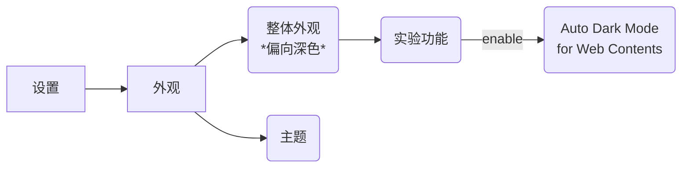
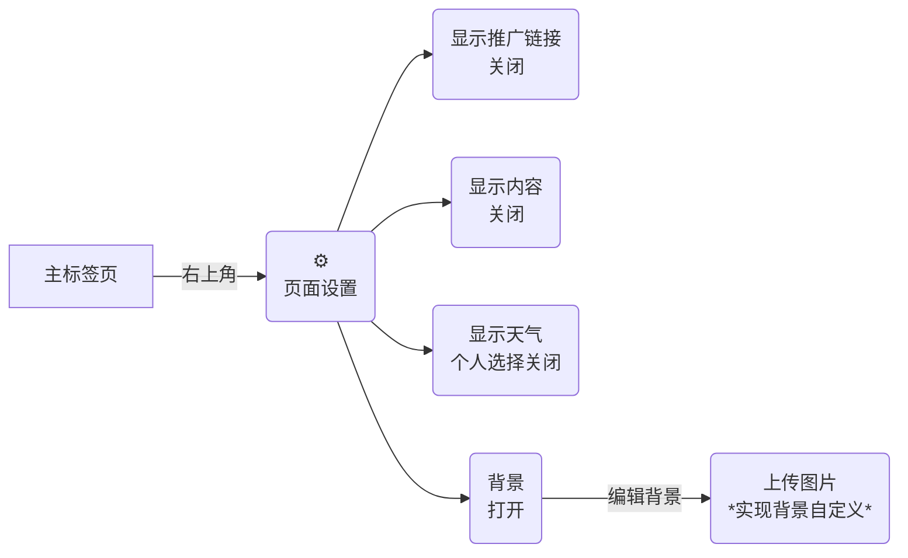

# 深入理解Microsoft Edge之我要成为浏览器高手：从Edge浏览器的外观设置到快捷键等基础功能的使用

- [1. 主题改造](#1-主题改造)
    - [1.1. 主题模式更改](#11-主题模式更改)
    - [1.2. 主界面更改](#12-主界面更改)
- [2. 边栏显示及相关操作](#2-边栏显示及相关操作)
    - [2.1. 收藏栏相关常用快捷键](#21-收藏栏相关常用快捷键)
    - [2.2. 地址栏相关快捷键](#22-地址栏相关快捷键)
    - [2.3. 标签页栏的设置](#23-标签页栏的设置)
- [3. 尾声](#3-尾声)

**主要效果展示**:  
  

## 1. 主题改造

### 1.1. 主题模式更改

看太久了屏幕,太亮的颜色有点闪眼,可以试试改成深色模式  
*(推荐系统同时也改成深色并开启自动隐藏系统底栏)*  
注意:深色模式不是非常完美,有时候会比较诡异,但总体来说还不错  



Microsoft Edge实验功能入口: ```edge://flags/```  
在Edge浏览器地址栏中输入  

### 1.2. 主界面更改

相信你一定觉得Microsoft Edge默认的HomePage新标签页一大坨的推广和不知所云的新闻实在是丑陋之极  
我原来的解决方案是使用插件直接更改新标签页  
实际上是可以更改的(效果见上图)  

步骤如下:  



## 2. 边栏显示及相关操作  

刘海太宽?屏幕占用太多?试试改改边栏显示  
顺便整理介绍了一些相关的快捷键  

### 2.1. 收藏栏相关常用快捷键

1. 隐藏/显示: `Ctrl`+`Shift`+`B`  
2. 将焦点转至收藏栏第一个: `Alt`+`Shift`+`B`  
3. 打开收藏夹: `Ctrl`+`Shift`+`O`  
4. 收藏/取消收藏当前标签页: `Ctrl`+`D`  

### 2.2. 地址栏相关快捷键

1. 切换焦点至地址栏并选中URL: `Ctrl`+`L`  
2. 地址栏中打开搜索查询: `Ctrl`+`E`/`K`  
3. 切换到地址栏第一个位置: `Alt`+`Shift`+`T`  
*一般指回退或刷新标签页*  

### 2.3. 标签页栏的设置

1. 横栏(顶部)和侧栏(左部)切换  
    可以右键顶部标签栏选择`打开垂直标签页`  
    也可以直接选择快捷键: `Ctrl`+`Shift`+`,`  
2. `打开垂直标签页`模式下,顶部默认会有标题栏  
    可以右键左侧标签页栏,选择`隐藏标题栏`  
3. 标签页栏功能推荐之`标签页组`  
    1. 创建与编辑方式:  

        ```mermaid
        flowchart LR
            A[标签页栏]-->|右键某标签页|B(标签页操作)  
            B-->C(将标签页添加到组)
            C-->D1(添加到现有组)
            C-->D2(添加到新的组)
        ```

    2. 自动整理  

        ```mermaid
        flowchart LR
            A[标签页栏]-->|最侧位置|B(Tab 操作菜单)  
            B-->C(整理标签页)
        ```

    3. 标签栏功能介绍:  
        1. 分类,看着顺眼  
        2. 可以展开或折叠,折叠的标签页组中的标签页不会被切换时打开  
    4. 可以搭配锁定标签页功能
        也挺好用的,可以固定一个标签页的状态,可以在操作后选择恢复到固定的状态  
4. 标签页相关的快捷键  
    1. 开启/关闭类:  
        1. 新建标签页: `Ctrl`+`T`  
        2. 关闭标签页:  
            1. 个人推荐的: `Ctrl`+`W`  
            2. 个人不推荐的: `Ctrl`+`F4`  
        3. 关闭所有标签页(即关闭当前窗口):  
            1. 推荐的: `Ctrl`+`Shift`+`W`  
            2. 不推荐的: `Alt`+`F4`  
            *为什么不推荐: 试一试就知道了,`F4`离`Ctrl`/`Alt`和右手都挺远的,实在是不如另外一种顺手*  
        4. 打开新的窗口:
            1. 正常: `Ctrl`+`N`  
            2. 无痕: `Ctrl`+`Shift`+`N`
        5. 打开关闭的标签页: `Ctrl`+`Shift`+`T`  
            *手贱关了不用怕,再打开就是了*  
    2. 切换类:  
        1. 搜索标签页: `Ctrl`+`Shift`+`A`  
            也可以在其中用上下箭头移动实现选择
        2. 向上/向下切换标签页:(以垂直标签页为准)  
            1. 单手操作推荐: `Ctrl`(+`Shift`)+`Tab`  
            2. 双手操作推荐: `Ctrl`+`Pageup`/`Pagedown`  
        3. 向上/向下调整标签页位置:(同样以垂直标签页为主): `Ctrl`+`Shift`+`Pageup`/`Pagedown`  
        4. 按顺序直接切换操作:  
        *个人感觉带小键盘的话双手操作还是挺舒服的*  
            1. 按照当前打开的标签页的顺序序号切换至对应页面: `Ctrl`+`1-8`  
            2. 直接切换至最后一个标签页: `Ctrl`+`9`  
    3. 标签页内操作类:  
        *想要在页内页解放鼠标?以下是一些推荐的快捷键*  
        1. 基础操作类:  
        *以下操作和**焦点**相关,关于这是一个什么东西,试一试就能直观地理解*  
            1. 将焦点转换至`···`处: `Alt`  
            2. 在切换焦点位置:  
                1. (`Shift`+)`Tab`  
                *根据观察可以跨窗格区域*  
                2. `箭头键`  
                *根据观察不可以跨窗格区域*  
                一般来说按照直观操作即可,与切换方向垂直的方向一般就是展开/收起选项列表的操作  
            3. 选中操作: `Enter`  
            4. 退出操作: `Esc`  
            5. 切换焦点所在窗格: (`Shift`+)`F6`  
            *根据观察`F6`会大致呈逆时针切换窗格*  
            *根据观察不加`Shift`时可以完整循环,加了则只能最终停在地址栏*
            6. 焦点在主页面内时:  
                1. 打开/关闭页内光标显示: `F7`  
                *关闭光标时页内翻页更顺畅*  
                2. 页内翻页:  
                    1. 上滑/下滑: `向上键`/`向下键`  
                    2. 上翻页/下翻页: `Pageup`/`Pagedown`  
        2. 标签页打开历史前进/后退: `Alt`+`向左键`/`向右键`  
        3. 搜索类:  
            1. 在页面上打开查找: `Ctrl`+`F`  
            *输入要搜索的词条后会匹配高亮*  
            2. 切换查找焦点: `Ctrl`(+`Shift`)+`G`  
        4. 其他功能类:  
            1. 刷新:  
                1. `F5`  
                2. `Ctrl`(+`Shift`)+`R`  
                *加上`Shift`可以忽略缓存内容*  
            2. 保存页面: `Ctrl`+`S`  
            3. 打开本地文件: `Ctrl`+`O`  
                *看PDF还是蛮好用,其他的文件类型不推荐*  
            4. `应用`功能:  

                ```mermaid
                flowchart LR
                    A[···]-->B(应用)-->C(将此站点作为应用安装)
                ```

                *严格来讲这不是一个快捷键,但确实挺好用的*  
                *大致功能为: 按类似于打开软件的方式打开一个标签页*  
                *对于某些不需要多重打开的网页站点有奇效*  

## 3. 尾声

初稿完于
本文经过研究和编写数个小时得出  
写下此篇文章的初衷为觉得浏览器看着有点不顺眼,于是在搜索引擎中探索看看有没有什么设定的方式  
然后此前本人对快捷键的使用有简单的了解,渐渐觉得能抛开鼠标减少手臂的快捷键的使用确实很棒  
*(特别是在使用VScode之后,图标多又小,有的命令还不能直接用鼠标启动,用鼠标更费劲了)*  
同时近期学习的Java书籍中有有关Web浏览器的内容,也是作为一种了解的方式,虽然本篇实际上只是使用方法的集合,并没有涉及太多有关浏览器的内容  
但是也对于焦点和浏览器的架构有了一定的新的了解  

此外,对Microsoft Edge浏览器的快捷键的学习的过程中  
不难发现,微软软件产品中很多基础的快捷键的逻辑是相通的  
对于浏览器的本身的快捷键的学习实际上也可以在VScode等(甚至Windows本身)快捷键的设计逻辑有一定的体会  
这是意义很大的  
*当然最重要的还是冲浪可以更丝滑了*  

最后,本篇仅代表本人观点,如有偏差错误欢迎指正补充  
也欢迎交流喵~

---

**[参考文献]:**

1. [Microsoft Edge 中的键盘快捷方式](https://support.microsoft.com/zh-cn/microsoft-edge/microsoft-edge-%E4%B8%AD%E7%9A%84%E9%94%AE%E7%9B%98%E5%BF%AB%E6%8D%B7%E6%96%B9%E5%BC%8F-50d3edab-30d9-c7e4-21ce-37fe2713cfad)  
2. [Edge浏览器的`应用`功能的使用](https://www.zhihu.com/question/398418010/answer/1790027234)  
3. [Edge浏览器顶栏的隐藏](https://www.zhihu.com/question/398418010/answer/3436687529)  
