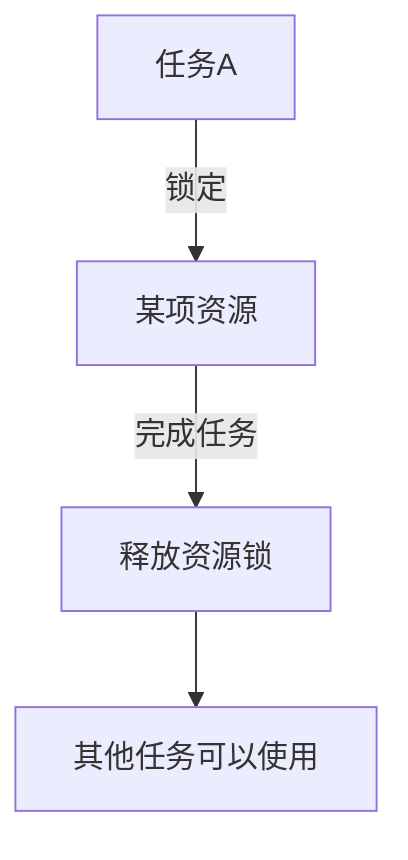

# 《Java编程思想》Reading Note

读《Java编程思想》  
定一下阅读的核心思想：  

1. 了解为主，记录重点  
2. 跟上实践，实践中认识  

---
**目录**：  

- [1. 第1章 对象导论](#1-第1章-对象导论)
    - [1.1 抽象过程](#11-抽象过程)
    - [1.2 对象的接口](#12-对象的接口)
    - [1.3 对象提供服务](#13-对象提供服务)
    - [1.4 被隐藏的具体实现](#14-被隐藏的具体实现)
    - [1.5 复用具体实现](#15-复用具体实现)
    - [1.6 继承](#16-继承)
        - [1.6.1 内涵](#161-内涵)
        - [1.6.2 理解](#162-理解)
        - [1.6.3 “是一个（is-a）”与“像是一个（is-like-a）“](#163-是一个is-a与像是一个is-like-a)
    - [1.7 伴随多态的可互换对象](#17-伴随多态的可互换对象)
        - [1.7.1 优点](#171-优点)
        - [1.7.2 多态的实现](#172-多态的实现)
        - [1.7.3 多态的应用方式](#173-多态的应用方式)
    - [1.8 单根继承结构](#18-单根继承结构)
    - [1.9 容器](#19-容器)
        - [1.9.1 起源](#191-起源)
        - [1.9.2 参数化类型](#192-参数化类型)
    - [1.10 对象的创建与生命期](#110-对象的创建与生命期)
        - [1.10.1 C++的参考](#1101-c的参考)
        - [1.10.2 Java的方案](#1102-java的方案)
    - [1.11 异常处理：处理错误](#111-异常处理处理错误)
    - [1.12 并发编程](#112-并发编程)
    - [1.13 Java与Internet](#113-java与internet)
    - [1.14 总结](#114-总结)

---

## 1. 第1章 对象导论

### 1.1 抽象过程

对于 **“对象”** 的理解  
**抽象**的重要意义  

简单来说：对象具有状态、行为和标识  
分别意味着：  

1. 状态：内部数据  
2. 行为：可以产生行为（表现为函数等）  
3. 标识：每个对象可以唯一与其他对象区分（具体来说，可以说表现为在内存中的地址不同）  

### 1.2 对象的接口

可以用类型来理解类：  
**类（class）的本质就是一个数据类型**，描述了有相同特性（数据元素）与行为（功能）的对象集合  

### 1.3 对象提供服务

对象的另一理解方式：**“服务提供者”**  
程序设计就是创建提供需要的服务的对象的过程  

好处：  
将问题和解决方案进行抽象  
提高内聚性  
提高程序可读性  

### 1.4 被隐藏的具体实现

即面向对象编程的重要内核之一：**封装**  
重点就在于，接口和实现的分离  

Java类内部边界设定关键字：  

1. `public`  
2. `private`  
3. `protected`  

### 1.5 复用具体实现

面向对象编程的另一重要内核与追求：**复用**  
复用方式：  

1. 直接创建类对象并使用
2. 将类的一个对象置于新的类中（创建一个成员对象）  
    类由其他类组成，通常称组合（composition）  
    若为动态发生，责成聚合（aggregation）  
    视为“has-a（拥有）”关系  

注意与下面的**继承**概念区分  
建立新类时首先考虑能否使用组合，可以更加简单灵活  

### 1.6 继承

依然是面向对象编程中的重要内核：**继承**  

#### 1.6.1 内涵

以现有类为基础，复制它，通过添加和修改此副本来创建新类  
描述为：**父类**到**子类**的过程  
注意这种方式，父类的修改也会体现在子类当中  

#### 1.6.2 理解

1. 基类型（父类）&导出类型（子类）  
    基类型描述了其导出类型所共享的特性和行为  
    （后面有实现差异方式的具体体现）
2. 继承现有类型，也就创造了新的类型  
3. 基类和导出类具有相同的基础接口，其必定伴随相应的具体实现  
4. 基类与导出类产生差异的两种方式：  
    1. 在导出类中新添方法（此时其接口不属于基础接口）  
    2. 改变现有基类的方法的行为，即**覆盖（overriding）**  
        具体表现为直接在导出类中创建该方法的新定义  

#### 1.6.3 “是一个（is-a）”与“像是一个（is-like-a）“

本质上区别在于继承方式（即理解中所述的父类与子类的差异方式）  

若导出类仅通过覆写基类继承，则称为纯粹替代，可以导出类与基类为“is-a”关系  
如果还有添加新的方法，则是”is-like-a“关系  

其中体现的思想很丰富，显然我们认为前者是最佳和最简单的，但是显然我们很多时候不得不使用后者  
这个过程中我们或许也可以思考，基类是否还足以描述我们所需要的导出类呢？  

### 1.7 伴随多态的可互换对象

本节讲述的是面向对象编程的另外一个重要内核：**多态**  

源自于我们非常常用的思维方式：**泛化（generic）**  
即我们处理一个对象，常常只是将其作为其基类的对象来对待，而并不想在意其继承后成为导出类型的具体类型  

#### 1.7.1 优点

泛化的好处是显然的：让我们可以写出不依赖于特定类型的的代码，因而在添加新的子类型时可以十分容易  
这对于我们的设计的优化和维护成本的降低意义极大！  

#### 1.7.2 多态的实现

1. 但这样显然也带来一个问题：应该如何将导出类型泛化为基类型？具体表现为程序因该如何知道在基类某一方法在子类表现不同时，到底应该执行哪段代码？  
    此答案也是面向对象程序设计的重要妙诀：**编译器不采用传统意义上的函数调用**  
2. 相关概念：  
    非面向对象编程编译器函数调用会引起**前期绑定**  
    而面向对象程序设计语言采用**后期绑定**的概念  
    解释：  
   1. **前期绑定**意味着编译器产生一个对于具体函数标识名的调用，然后运行时将其解析到将要被执行的代码的绝对地址  
   2. **后期绑定**则是OOP语言编译器先保证被调用方法的存在，并对调用参数和返回值执行类型检查（强类型的语言特征之一）  
   Java再采用一小段特殊代码代替绝对地址调用，使用了在对象中存储的信息来计算方法体的地址，因而每一个对象都可以具有不同的行为表现  
   3. 注意，C++需要明确声明（通过`virtual`）才会次啊用后期绑定属性，但是Java动态绑定是默认行为  
3. 对于将导出类看作是它的基类的过程，我们则有专门的名称：**向上转型（upcasting）**  
    名源于继承图常用的基类在上、导出类向下散开的经典布局方式  

#### 1.7.3 多态的应用方式

我们如果编写一段代码，其忽略类型的具体细节，而仅与基类进行交互。那么代码和具体类型信息是**分离的（decoupled）**  

优点：

1. 使代码编写更为简单且易于理解  
2. 可以通过继承机制为基类添加新导出类型，那么已有的代码将会同样可以作用于新的类型，使得程序具有**可扩展性**  

### 1.8 单根继承结构

- [ ] TODO:（暂时还没能完全理解） #3  

java采用单根继承结构  
即：所有的类都继承自单一的基类  
这个终极基类的名字为`Object`  

单根继承结构中，所有的对象均具有一个共用的接口，因此它们归根到底都是相同的基本类型  

单根继承结构保证所有的对象都具有某些功能  
这有几点好处  

1. 在系统中可以在每个对象上执行某些基本操作  
2. 对象都可以容易地在堆上创建  
3. 参数传递得到了极大的简化  
4. 使得垃圾回收器的实现变得容易得多  
    *垃圾回收器是java相对C++的重要改进之一*  

### 1.9 容器

#### 1.9.1 起源

在实际情况中，我们往往不知道在解决某问题时需要多少个对象，这些信息通常只有运行时才能获得  

因此面向对象语言中选择创建另一种新对象进行解决，这种对象通常被称为**容器**  
这种对象类型持有其他对象的引用  
它们可以在任何时候根据需要扩容  

设计思想：  
需要的是可以被操作，从而解决问题的序列  
因而需要的是尽量简单化和统一化  
但是由于以下两种原因  

1. 不同容器提供不同类型的接口和外部行为  
2. 不同容器对于某些操作具有不同的效率  

#### 1.9.2 参数化类型

Java中，早期版本容器存储对象仅有通用类型`Object`  
因此Java中所有对象都可以通过向上转型为`Object`而置入容器  
但这样就会有一个问题：存入时丢失了具体身份的对象，取出时应该如何变回存入前的对象？  

此处则使用了另一个方法：**向下转型**  
与向上转型相反，不是泛化，而是转为更具体化的类型  

但是向下转型我们仍然需要以某种方式记住对象的具体类型，才可以正确执行向下转型  
因而**参数化类型机制**的解决方案被提出  
**参数化类型（也称泛型）**：一个编译器可以自动定制作用于特定类型上的类  

示例：创建一个存储`Shape`的`ArrayList`  

```java
ArrayList<Shape> shapes = new ArrayList<Shape>()
```

### 1.10 对象的创建与生命期

正如C中变量有`全局`、`局部`、`静态`之分  
他们有着不同的`作用域`与`声明周期`  
这在面向对象编程中，也是我们使用对象时最关键的问题之一：  
**对象的生成方式与销毁方式**  

#### 1.10.1 C++的参考

作为参考，C++中由两种方式创建对象：  

1. 将对象置于堆栈（它们有时被称为`自动变量`或`限域变量`）或静态存储区域内  
    对象地存储空间和声明周期在编写程序时确定，对于提高执行速度有作用  
    但是牺牲了灵活性，需要在编写时确定对象数量、声明周期、类型  
2. 在被称为堆（heap）的内存池中动态地创建对象  
    对象的数量、生命周期、类型在运行时才能确定，具有较高地灵活性  
    但是创建对象时在堆中分配存储空间的时间可能远远大于在堆栈中所需时间，具体来说依赖于存储机制地设计（数据结构）  

#### 1.10.2 Java的方案

Java完全采用**动态内存分配方式** *（即上述第二种方式）*  
具体来说，每当要创建新对象时，就要使用`new`关键字来构建此对象的动态实例  

动态方式采用一个一般性的逻辑假设：  
**对象趋于变得复杂，查找和释放存储空间的开销不会对对象的创建造成重大冲击**  
因此动态方式的选择是对于解决一般化编程问题的更大灵活性的选择  

另外Java提供了 **“垃圾回收器”** 的机制用于处理内存释放问题  
其可以自动地发现对象何时不再被使用，并继而进行销毁（C++中则必须通过编程方式来确定）  

个人理解：  
Java通过限制对象继承的**单根继承机制**与对象创建的**动态内存分配方式**  
使得所有对象都继承自单根基类`Object`且只能在对上被创建  
使得Java编程的过程更为简单，可以减少决策量与障碍量  

### 1.11 异常处理：处理错误

**异常处理**将**错误处理**直接置于编程语言中，有时甚至置于操作系统中  

**异常**是一种`对象`，其从错误点被“抛出”，并被专门设计为用于处理特定类型错误的相应的异常处理器“捕获”  
`异常`不能被忽略，因而保证其一定在某处得到处理  
此外，`异常`提供了一种从错误状态进行可靠恢复的途径  

- [ ] TODO: #5 : Java异常处理机制理解

Java的异常处理特别之处在于：  

1. Java从最开始就内置了异常处理  
2. Java的异常处理必须使用，且是唯一可接受的错误报告方式  

### 1.12 并发编程

源自计算机编程中的一个基本概念：  
**同一时刻处理多个任务的思想**  

许多程序设计问题要求程序可以停下正在做的工作（可以称为中断），转而处理其他问题，再返回主进程  
有时中断对于时间性强的任务是必需的，不过对于大量其他问题，仅仅是想要将问题进行切分，划为多个可独立运行的任务，从而提高程序的响应能力  
以上描述中，程序中的彼此独立运行的部分称为**线程**，而以上进行划分的概念就是**并发**  

但其中存在一个隐患：**共享资源**  
即如果多个并行任务试图要访问同一项资源，就会出现问题  
解决方案是，将可以共享的资源，在使用期间进行锁定  

因此整个过程可以描述为：  



Java的并发是内置于语言中的  

### 1.13 Java与Internet

Java的最为重要意义之一就是其解决了在万维网（WWW）上的程序设计问题  

本节简单的讲述了Java在Internet中发挥重要作用的背景与方面  
大致分为以下几个部分

1. 解释Web的概念
   1. 客户/服务器计算技术  
   2. **Web就是一台巨型服务器**  
    Web的“服务器-浏览器”设计概念  
2. 客户端编程的相关问题与方法概述  
   1. 插件（plug-in）
   2. 脚本语言（scripting-language）  
    典型代表`JavaScript`（注意虽然名字比较像，但是和`java`只存在表面上的相似）  
   3. Java  
      1. applet  
      2. Java Web Start  
   4. 备选方案  
    Macromedia的`Flex`（和我们之前熟悉的`Flash Player`有关）  
   5. `.NET`和`C#`  
3. 服务器端编程  
Java取得巨大成功的因素之一  
本书中不太涉及  

### 1.14 总结

面向过程编程语言程序通常的模样：数据定义和函数调用  
这些程序容让人迷惑，因为其表示术语更加面向计算机而非所要解决的问题  

OOP，以Java来说，其程序中我们所见的只有关于以下两部分内容的定义：  

1. 用以表示问题空间概念的对象
    更多是面向问题的内容和方法而非有关计算机表示方式的相关内容  
2. 发送给这些对象的用来表示在此空间内的行为的信息  

OOP的这个特性，极大的便于人们阅读程序——对于设计良好的程序，仅仅是阅读其就可以很容易的理解代码  
并且，类库的更多重用，也可以较大程度上减少代码量  

最后，OOP和Java也只是编程的一种解决方式  
最重要的还是评估我们的需求，选择合适的方式  
