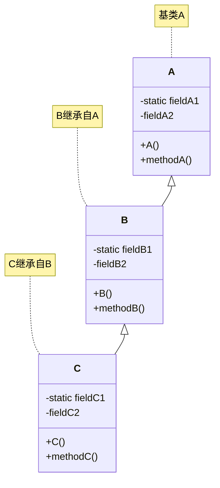

# 《Java编程思想》Chapter 7 : 复用类

Java众多优秀特性之一中，非常重要的一种就是对于代码的复用
但仅仅对于代码的复用，还不够  
需要做到更多的事情  

**重点：**  
使用类而不破坏现有的程序代码  

**方法：**  

1. **组合**  
    在新的类中产生现有的类的对象  
    只服用了现有程序代码的功能，而非其形式  
2. **继承**  
    按照现有类的类型来创建新的类  
    无需改变现有类的形式  
    采用现有类的形式并在其中添加新代码  
    大部分的工作交由编译器来完成  

---

- [1. 组合语法](#1-组合语法)
    - [1.1. 一种特殊的方法介绍：`toString()`](#11-一种特殊的方法介绍tostring)
    - [1.2. 对象初始化](#12-对象初始化)
- [2. 继承语法](#2-继承语法)
    - [2.1. 继承的语法](#21-继承的语法)
        - [2.1.1. 继承中基类的规范](#211-继承中基类的规范)
        - [2.1.2. 继承拓展行为的方式 \& `super`: 超类关键字](#212-继承拓展行为的方式--super-超类关键字)
        - [2.1.3. 初始化基类](#213-初始化基类)
- [3. 代理](#3-代理)
    - [3.1. 代理的概念](#31-代理的概念)
    - [3.2. 代理的优点](#32-代理的优点)
- [4. 组合和继承的结合使用](#4-组合和继承的结合使用)
    - [4.1. 确保正确清理](#41-确保正确清理)
    - [4.2. 名称屏蔽](#42-名称屏蔽)
- [5. 在组合和继承之间选择](#5-在组合和继承之间选择)
- [6. `protected`关键字](#6-protected关键字)
- [7. 向上转型](#7-向上转型)
    - [7.1. 为什么需要向上转型？](#71-为什么需要向上转型)
    - [7.2. 再论组合与继承](#72-再论组合与继承)
- [8. `final`关键字](#8-final关键字)
    - [8.1. `final`修饰数据](#81-final修饰数据)
        - [8.1.1. 编译期常量](#811-编译期常量)
        - [运行时常量](#运行时常量)
    - [`final`修饰方法](#final修饰方法)
        - [`final`与`private`的关系](#final与private的关系)
    - [`final`修饰类](#final修饰类)
- [初始化及类的加载](#初始化及类的加载)
    - [继承与初始化](#继承与初始化)

---

## 1. 组合语法

组合技术，实际上我们已经一直在使用  
我们只需要将对象引用至于新的类中即可  

### 1.1. 一种特殊的方法介绍：`toString()`

这是一种在`Object`类中的方法  
而我们知道所有的类都继承自`Object`类  
也就是说所有的类都会有`toString()`方法  

当编译器需要一个String而我们只有一个对象时  
这个方法就会被调用  

### 1.2. 对象初始化

正如[Chapter 5对象的初始化](./20250304Chapter5.md/#6-成员初始化)中所讲  
我们对象中的类的引用类型的成员变量默认情况下会被初始化为`null`  
这很有意义，减少了很多不必要的负担  

而我们想要初始化应该如何做？  

1. 定义处就进行初始化  
2. 构造器初始化  
3. 在使用这些对象之前进行初始化（惰性初始化，和懒加载的概念相关）  
4. 使用实例初始化  

## 2. 继承语法

**继承是所有OOP语言和Java语言中不可缺少的组成部分**  
Java中，创建一个类时，总是在继承——  
除非已明确指出继承自某类  
否则就是隐式地继承自标准根类`Object`  

### 2.1. 继承的语法

组合语法符合我们之前一直的直觉  
而继承使用的则是一种特殊的语法：  
**继承过程中，我们需要先声明“新类与旧类相似”**  
这个过程中我们使用关键字 **`extends`**  

示例：  

```java
class A {
    public void foo1 { }
}

class B extends A {
    public void foo2 { } 
}
```

这里，`B`类继承自`A`类  

我们声明某个类继承自另一个类使用:  

```java
class A extends B
```

*补充：我们可以为每个类都创建一个`main()`方法，使得每个类的单元测试变得更加简便易行。只有最终指定运行的类中的`main()`方法会被执行*  

#### 2.1.1. 继承中基类的规范

为了继承，一般的规则为：  

- 将所有的数据成员指定为`private`  
- 将所有的方法指定为`public`  
- 以及目前没有接触的`protected`成员也可以借助导出类来访问  

#### 2.1.2. 继承拓展行为的方式 & `super`: 超类关键字

我们在继承的过程中，可以创建新的方法，也可以覆盖旧的方法  
但是偶尔我们在覆盖旧方法时，会需要调用旧的方法  
这时候如果直接调用方法的标识符，实际上调用新的方法，从而导致递归调用  

Java引入 **`super`** 来解决此问题，表示超类的意思  
当前类就是从超类中继承而来  
使用`super.method()`来调用超类的方法  

#### 2.1.3. 初始化基类  

我们经过上述描述，已经大致了解到继承的用途：  
使得导出类获得基类的形式  
但是，我们可能会产生疑惑：导出类产生的对象是什么样的情况？  

实际上，继承并不只是复制基类的接口  
**创建导出类的对象时，该对象包含了一个基类的子对象**  
这个子对象被包装在导出类的对象中  

那么我们对于基类子对象的正确初始化也很重要  
我们只有一种方法来对此进行保证：  
**在构造器中调用基类构造器执行初始化**  

Java会自动在在导出类的构造器中插入对基类构造器的调用  
顺序上来说，优先于导出类构造器中的行为  
形象上理解，构建过程是从基类"向外"扩散的  
示例：[SubObjectConstructor.java](../../1_code/0_2_test2/SubObjectConstructor.java)  

当然上述自动插入适用于默认构造器  
但是，如果没有默认基类构造器，或者想要调用一个带参数的基类构造器  
就必须使用`super`关键字，显式地调用基类构造器  

```java
class A
{
    A( int i )
    {
        System.out.println("A constructor") ;
    }
}

class B extends A
{
    B(int i)
    {
        super(i) ;
        System.out.println("B constructor") ;
    }

    public static void main(String[] args)
    {
        B b = new b(1) ;
    }
}
```

## 3. 代理

除去上述两种关系（组合、继承）之外，第三种关系称为 **代理**  
Java没有提供直接支持  
可以认为其为继承与组合之间的中间道路  

### 3.1. 代理的概念

我们不直接是用继承，而也不局限于使用组合  
我们将一个类的对象作为成员置于我们所要构建的类中  
同时我们在新类中暴露了该成员对象的所有方法  
*也就是说我们在新构建的类中创建方法用来代理成员对象的行为*  
*当然我们也可以从另一个角度理解：使用成员对象的行为代理我们新建类中方法所要做的行为*  

### 3.2. 代理的优点

1. 某些情况下概念上更加直观  
    例如一个系统和系统中的控制器  
    我们自然可以让系统从控制器中继承而来  
    但是实际上系统只是包含这个控制器  
2. 相较于组合控制性更强  
    本质上其实和组合相差不大  
    实际上做的事可以认为是将成员对象的接口映射至新建类中  
    在这个过程中，我们还可以对暴露的接口进行选择，只提供成员对象中的方法的某个子集  
    这使得我们使用代理时可以拥有更多的控制力  

## 4. 组合和继承的结合使用

这是很常见的，我们不难想象  

值得注意点的是：  
编译器会强制我们去初始化基类  
并且在构造器起始处就这么做  
但是它并不会监督我们将成员对象也进行初始化  
我们应当谨记这一点  

### 4.1. 确保正确清理

我们已经知道Java的一大特性就是垃圾回收机制  
这是很好的，我们不用再担心我们创建的对象什么时候就把我们内存爆了  
这让我们习惯于忘记对象而非手动销毁对象  

但是我们不知道垃圾回收器什么时候会被调用  
或者它究竟会不会被调用  
如果我们确实希望某个类清理某些东西  
我们必须显示地编辑一个特殊方法,并让客户端程序员知道必须要调用此方法  
(此处不会详细提及,仅作为前瞻)  
实际上也就是必须放在`finalize`子句中,以防止异常的发生  

这里已经涉及到了Java中非常关键一组关键字  
`try` and `finally`  
简单来说  

- `try` 后的子句,是保护区(guarded region),表示会被特殊处理  
- `finally` 特殊处理的一种,表示`try`子句是如何退出,`finally`中的代码都会被执行  

而不难理解的是  
我们执行类的所有特定的清理动作,他们的顺序是与我们创建对象的顺序相反的  

总之对于一旦涉足于垃圾回收  
我们就需要很谨慎了  
我们最好是除了内存以外,不要依赖垃圾回收器来处理任何事情  
不过也不要使用`finalize()`  

*例如Java中占用了网络连接的资源,比如构建了SSH连接,或者打开了文件我们需要资源被释放,就不要指望垃圾回收器来处理了*  

### 4.2. 名称屏蔽

Java基类中被重载的方法,若在导出类中重新定义的重载方法不会屏蔽基类中的任何版本  
(这和C++中是不同的)  

这可能并不是我们想要的  
(很多情况,我们我们希望的是之接进行覆写,而非重载)  
为了防止这种情况的发生  
Java SE5增加了注解`@Override`  
当我们想要覆写某个方法时，可以添加在方法之前  
这样，当我们不小心重载而非覆写这个方法时，编译器会进行报错  

```java
class A
{
    public void foo() {}
    public void foo(int i) {}
}

class B extends A
{
    // 编译器报错
    //@Override int foo() {}

    @Override
    public void foo() {}
}
```

## 5. 在组合和继承之间选择

问题来了：组合 or 继承？  

一般来说：  

1. **组合**  
    组合适用于我们想在新类中使用现有的类的功能而非接口的情况  
    这时候我们往往会选择向新类中嵌入一个现有类的`private`实例  

    当然如果成员所属的类封装的足够好，有时候我们也可以选择将其声明为`public`  
    这对于类的使用者来说会更容易理解，我们的代码复杂度也可能降低  
    但是一般来说使用`private`来限制域是更好的  
2. **继承**  
    继承,意味着我们在现有的类的基础上,开发一个特殊版本  
    这意味着我们使用一个通用类,为了某种需求将其特殊化  

简单来说我们可以思考一下  
我们所要构建的类与现有的类的关系究竟如何？  

1. `is-a`  
2. `has-a`  

前者一般意味着使用继承,后者一般意味着选择组合  

## 6. `protected`关键字

在了解完继承的意义之后  
我们所提及的`protected`关键字也就具有了意义  

我们想想这样一种情况,  
我们希望将某些事物尽可能地隐藏起来  
但我们仍期望导出类的成员可以对其进行访问  
这就是`protected`的意义所在  

相对于`private`  
`protected`提供了包内其他类对于该成员的访问权限  
而相对于`protected`  
包外除了导出类的成员之外,其他类是无法访问的  

```java
class A
{
    private field1;
    protected field2;
}

class B extends A
{
    public void foo()
    {
        // 编译器报错
        //field1 = 1;

        field2 = 2; // 正常
    }
}
```

## 7. 向上转型

为子类提供基础方法，是继承的一大特性  
但继承中最重要的方面并不在此  
而在于继承可以用来表现新类和基类之间的关系  
也就是`is-a`关系  

这并不只是局限于概念上动嘴皮子  
而是作为语言的基础  

也就是说class `B` 继承自 class `A`  
那么`B`就是一种`A`  
也就是说我们可以把`B`的对象当作`A`  
这是非常有趣的  

打个比方来说  
我们根据`short`变量拓展出了`int`变量  
在不超过`short`范围的情况下，我们`int`就可以当作`short`来使用  
并且我们也可以将`int`转回`short`  

### 7.1. 为什么需要向上转型？

**概念：**  

所谓的向上转型  
源自于我们在继承关系图中，一般将基类画在上放，而导出类画在下方  
我们将导出类的对象的引用转换为基类的引用的动作  
就是 **向上转型**  

在继承中  
由于继承可以保证基类中的所有方法在导出类中同样有效  
因此向基类发送的所有信息都可以被导出类所理解  
因此我们将导出类的对象作为基类来使用，只可能损失特化的一些属性  
而不会获得一些实际上的对象无法处理的方法  
因此，编译器在没有明确指明的情况下，也允许向上转型  

*注意：此处我们只是将引用进行了转换，实际的对象是不会变的*  

### 7.2. 再论组合与继承

继承很好，很OOP
但是并不意味着我们时时刻刻都一定使用这种方式  

什么时候要使用？  
仅仅局限于我们确信该技术确实有效的情况  
最清晰的判断方法——  
我是否需要从新类向基类进行向上转型？  
如果这是必须的，那么继承是必要的；  
如果不需要，则再好好思考一下  

## 8. `final`关键字

`final`关键字,大体上都表示"这是不可改变的"的意味  
但具体上来说存在着细微的差别  

### 8.1. `final`修饰数据

大部分编程语言都有类似类似的方法  
告诉编译器某些域是不变的  

许多情况下,我们需要这样的功能:  

1. 一个不会改变的编译时常量  
2. 一个运行时被初始化的值,但我们不希望它被改变  

#### 8.1.1. 编译期常量

上述中两种功能中，前者可以减轻运行时负担  
Java中,它们必须是基本数据类型,并以`final`表示  
并且,定义时应当进行赋值  
*不难理解，`static` + `final` 修饰的域只会占据一段不会改变的存储空间*  

但是当`final`用来修饰引用类型时  
我们仍然可以修改引用所指向的对象  
因为`final`并不表示对象本身不可变  
而是表示引用本身不可变  

简单来说我们需要记住的就是`final`表示所修饰的域不可以改变  
并且只局限于这一部分不可以变  

**典型的常量定义方式:**  

1. 使用`public`修饰  
2. 使用`static`修饰  
3. 使用`final`修饰  
4. 标识符全都使用大写字符  

示例：  

```java
class FinalTest {
    public final static int a = 1 ;
}

public class Test3{
    public static void main(String[] args) {
        System.out.println(FinalTest.a);
    }
}
```

结果是1  
如果试图对`a`进行修改  

```java
class FinalTest {
    public final static int a = 1 ;

    public FinalTest(int a) {
        this.a = a;
    }
}

public class Test3{
    public static void main(String[] args) {
        // 编译错误
        FinalTest test = new FinalTest(1);
        System.out.println(FinalTest.a);
    }
}
```

会显示如下错误  

```txt
.\Test3.java:5: 错误: 无法为 static final 变量 a 分配值
        this.a = a;
            ^
1 个错误
错误: 编译失败
```

#### 运行时常量

上述提到的还有第二种请况  
具体来说也可以分为几种：  

1. 空白`final`  
2. `final`参数  

Java允许生成“空白`final`，即被声明为`final`但有没直接给定初值的域  
不过尽管没有在初始化时直接给定值，但一定要确保在使用前被初始化  

示例：  

```java
class FinalTest {
    public final int a ;

    public FinalTest(int a) {
        this.a = a;
    }
}

public class Test3{
    public static void main(String[] args) {
        FinalTest test1 = new FinalTest(2);
        FinalTest test2 = new FinalTest(3);
        System.out.println(test1.a);
        System.out.println(test2.a);
    }
}
```

*结果是2和3*  
*当然，当我们试图再次修改时依然会报错*  
这种技术使得`final`的使用可以更加灵活  

除上述请况外，Java允许将方法的参数指明为`final`  
意思差不多，就是说这个参数在方法中不可改变  
实际上这在后面用来向匿名内部类中传递数据非常有用  
此处暂不涉及  

### `final`修饰方法

简单来说，这种用法两个原因：  

1. 锁定方法，不然任何继承类修改该方法  
2. *为了效率(这个原因在现在已经被淡化)*  
    *现在这种方式正在被劝阻*  

#### `final`与`private`的关系

所有的`private`方法都隐式地指定为`final`  
这很容易理解，子类访问不到基类地`private`方法，自然也不用谈覆盖  

但是我们不禁思考：  
假如子类中定义了基类中的`private`方法一模一样的方法(指参数和返回值)，会发生什么？  
答案是与基类中的方法没有任何关系  
或者说它们只有名称相同而已  

这不难理解，`private`的方法的可见域在基类之内  
它无法在任何情况下干扰到子类中同样的方法的使用  
因此它们之间毫无瓜葛  

这也为我们提供了一个理解`private`的视角  
`private`所修饰的部分,可以当成时其所属的类的组织结构  
当我们需要总体审视这个类的时候,我们不需要考虑任何关于`private`的部分  

### `final`修饰类

没错,`final`也可以修饰类  
我们之前只知道`public`和`default`的class种类  

`final`修饰类的原因和其修饰方法的原因其一类似  
如果我们不希望类被继承,那就用`final`修饰它  

## 初始化及类的加载

Java采用与以往许多传统语言在启动过程不同,  
它们往往将程序作为启动过程中的一部分立刻被加载,然后就是初始化,进阶着程序才开始运行  
因此它们的初始化必须极其的小心,确保定义为`static`的部分的初始化顺序不会造成问题  

让我们想起Java的一大特征"万物皆对象"  
Java每个类的编译代码存在于其自身的独立的文件之中  
而该文件只在需要使用的时候才会被加载  

不过值得注意的是  
这里的使用有很多情况  
不止使用类的对象时才会被加载  
当我们访问类的`static`域时,也会发生加载  

对于类中的`static`域,  
我们初次使用这个类的时候,就是它们被初始化的时候  

### 继承与初始化

了解包括继承在内的初始化的全过程是大有脾益的  
这对于我们理解程序的行为十分重要  

具体来说：  
假如有三个类`A`、`B`、`C`



初始化顺序：

1. 加载父类的静态成员和静态初始化块
2. 加载子类的静态成员和静态初始化块
3. 执行父类的实例初始化块和构造器
4. 执行子类的实例初始化块和构造器

实际上，构造器本身就是`static`方法  
因此我们可以说，类时在其任何`static`成员被访问时加载的  
