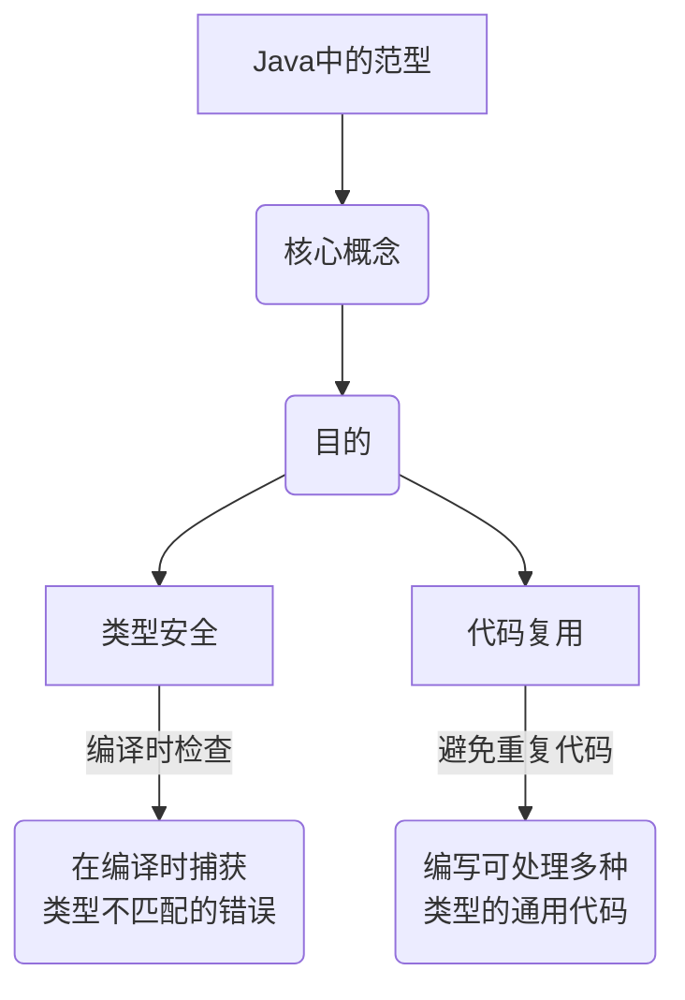
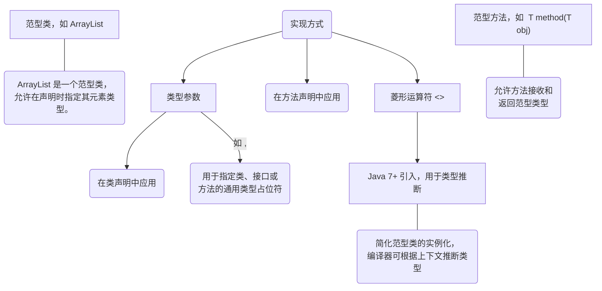
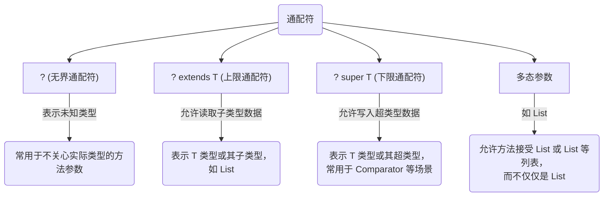
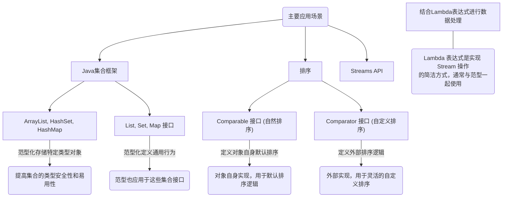
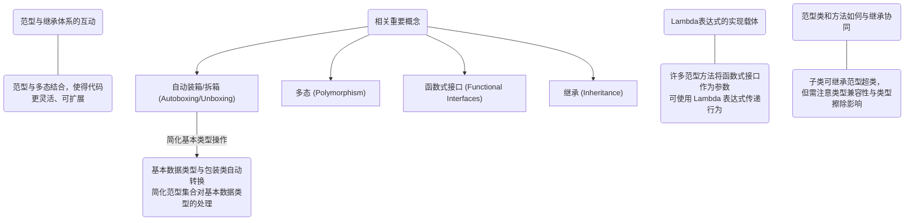

### Java 范型知识结构

#### 1. 范型核心概念与目的

以下图表展示了 Java 范型作为核心概念及其主要目的。

#### 2. 范型实现方式：类型参数与菱形运算符

此图表详细说明了范型如何通过类型参数和菱形运算符来实现其功能。

#### 3. 范型实现方式：通配符与边界

此图表深入探讨了通配符及其边界在范型中的作用，特别是如何支持多态参数。

#### 4. 范型主要应用场景

此图表列举了范型在 Java 编程中的几个主要应用场景，包括集合、排序和 Stream API。

#### 5. 范型相关重要概念

此图表展示了与 Java 范型密切相关的其他重要概念，这些概念共同构成了范型在 Java 生态系统中的完整图景。

希望这些拆分后的图表和详细解释能帮助你更好地理解 Java 范型！如果你有任何其他问题，请随时提出。