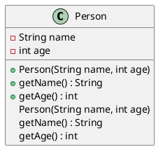

# Week 4

## UML

Unified Modeling Language  
一种用于描述、设计、构建和文档化软件系统的可视化语言  

**价值所在：**

- 标准化
- 易于理解（入门）
- 设计规划

## 类图

**例子：**  



主要模型元素  

1. 基本元素
    - 类
    - 接口
    - 枚举
2. 类型之间的关系  
    - 继承（泛化），实现
    - 关联、聚合、组合、依赖
3. 综合示例

### 类与成员的可见性

|sign|key word|可见性|
|---|---|---|
|+|public|公有|
|-|private|私有|
|#|protected|受保护|
|~|package|包访问权限|

### 具体表示示例

1. **接口：**  
    定义了类或组件的规范  
    规定了类或组件必须实现的方法  
    UML中，用矩形表示，包含方法签名  
    使用`interface`表示  

    ```plantuml
    @startuml
    interface Person {
        + getName() : String
        + getAge() : int
    }
    @enduml
    ```

2. **枚举：**  
    一种特殊的类，表示一组固定的常量值  
    UML中，用`enum`表示  

    ```plantuml
    @startuml
    enum WeekDay {
        MONDAY
        TUESDAY
        WEDNESDAY
        THURSDAY
        FRIDAY
        SATURDAY
        SUNDAY
    }
    @enduml
    ```

3. **类的继承关系：**
    子类可以复用父类的属性和方法  
    子类自动获得父类的特性，具有父类的类型  
    可以添加新特性或重写父类行为  
    UML中，使用空心三角箭头从子类指向父类  

    ```plantuml
    @startuml
    class Person {
        - String name
        - int age
        + Person(String name, int age)
        + getName() : String
        + getAge() : int
    }

    class Student {
        - String school
        + Student(String name, int age, String school)
        + getSchool() : String
    }

    Person <|-- Student
    @enduml
    ```
