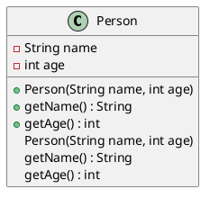

# Week 4

## UML

```plantuml
@startuml
class Person {
    - String name
    - int age
    + Person(String name, int age)
    + getName() : String
    + getAge() : int
}

Person : Person(String name, int age)
Person : getName() : String
Person : getAge() : int
@enduml
```

### 类与成员的可见性

|sign|key word|可见性|
|---|---|---|
|+|public|公有|
|-|private|私有|
|#|protected|受保护|
|~|package|包访问权限|

### 枚举类型

定义了一组固定的常量值  
其于编译时确定  
