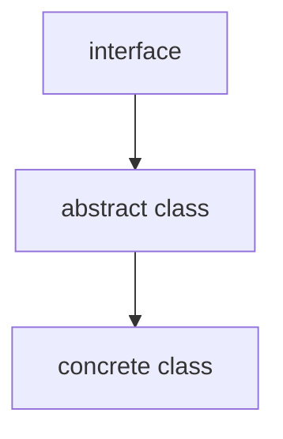

# Lists, Stacks, Queues and Priority Queues

some data structure containers in Java std libs  

## Collection Framework(集合框架)

Collection(interface)

- Set(interface)
- List(interface)
- Queue(interface)

structure:  



### Collection Interface

some basic methods

## List Interface

a list stores elements in a sequential order  
allows user to specify where the element is stored  
the elements can be accessed by index  

### Basic Methods

### List Iterator

### ArrayList and LinkedList

two concrete implementations of the List interface:  

- ArrayList:  
    normal linear array  
- LinkedList:  
    linked list  

## Comparator Interface

if you want to compare some elements of different types  
(maybe you want to sort a list of students by their age, ID, name or e.t.c.)  

you can define a class implementing the `java.util.Comparator` interface  
which has the compare method for comparing two elements  

the `compare` method:  

```java
public int compare(Object o1, Object o2) {
    // logic for comparing two elements
    // ...
}
```

return:  

- -1: o1 is less than o2  
- 0: o1 is equal to o2  
- 1: o1 is greater than o2  

## Collections Class

not allowed to create instances of the Collections class  
in stead, it provides various static methods for operating the containers  

## Vector Class

almost the same as the ArrayList class  

## Stack Class

Stack class is extended from the Vector class  
representing the LIFO stack of objects  

in other words, the elements can only be accessed from the top of the stack  
(retrieve, insert or remove elements should also form the top)  

## Queues and Priority Queues

a Queue in a FIFO(First In First Out) data structure  

that is to say,  
the elements are appended to the end of the queue  
and are removed from the beginning of the queue  

elements in priority queues are assigned priorities  
when accessed, the elements with higher priorities are retrieved first  

### Queue Interface
